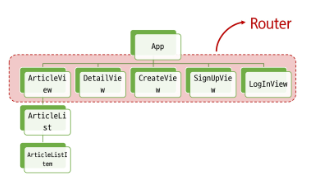
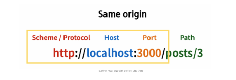
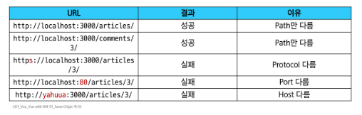
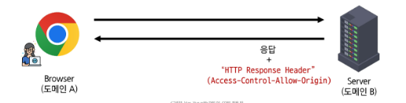

# Vue - Vue with DRF 01
# 프로젝트 개요
- 앞으로 수업에서 진행할 프로젝트
    1. Vue와 DRF 간 기본적인 요청과 응답
    2. Vue와 DRF에서의 인증 시스템
    3. User 커스터카이징
## DRF 프로젝트 안내
- 스켈레톤 프로젝트 django-pjt 제공
- 외부 패키지 및 라이브러리는 requirements.txt에 작성되어 있음
- DRF 프로젝트는 제공된 스켈레톤 코드의 주석을 해제하며 진행
### Skeleton code 살펴보기
- Model 클래스 확인
```python
# articles/models.py

class Article(models.Model):
    # user = models.ForeignKey(
    #     settings.AUTH_USER_MODEL, on_delete=models.CASCADE
    # )
    title = models.CharField(max_length=100)
    content = models.TextField()
    created_at = models.DateTimeField(auto_now_add=True)
    updated_at = models.DateTimeField(auto_now=True)
```
```python
# accounts/models.py

class User(AbstractUser):
    pass
```
- URL 확인
```python
# my_api/urls.py

urlpatterns = [
    path('admin/', admin.site.urls),
    path('api/v1/', include('articles.urls')),
    # path('accounts/', include('dj_rest_auth.urls')),
    # path('accounts/signup/', include('dj_rest_auth.registration.urls')),
]
```
```python
# articles/urls.py

urlpatterns = [
    path('articles/', views.article_list),
    path('articles/<int:article_pk>/', views.article_detail),
]
```
- Serializers 확인
```python
# articles/serializers.py

class ArticleListSerializer(serializers.ModelSerializer):
    class Meta:
        model = Article
        fields = ('id', 'title', 'content')


class ArticleSerializer(serializers.ModelSerializer):
    class Meta:
        model = Article
        fields = '__all__'
        # read_only_fields = ('user',)
```
- views.py의 import 부분 확인
```python
# articles/views.py

from rest_framework.response import Response
from rest_framework.decorators import api_view
from rest_framework import status

# permission Decorators
# from rest_framework.decorators import permission_classes
# from rest_framework.permissions import IsAuthenticated

from django.shortcuts import get_object_or_404, get_list_or_404

from .serializers import ArticleListSerializer, ArticleSerializer
from .models import Article
```
- View 함수 확인
```python
# articles/views.py

@api_view(['GET', 'POST'])
# @permission_classes([IsAuthenticated])
def article_list(request):
    if request.method == 'GET':
        articles = get_list_or_404(Article)
        serializer = ArticleListSerializer(articles, many=True)
        return Response(serializer.data)

    elif request.method == 'POST':
        serializer = ArticleSerializer(data=request.data)
        if serializer.is_valid(raise_exception=True):
            serializer.save()
            # serializer.save(user=request.user)
            return Response(serializer.data, status=status.HTTP_201_CREATED)


@api_view(['GET'])
def article_detail(request, article_pk):
    article = get_object_or_404(Article, pk=article_pk)

    if request.method == 'GET':
        serializer = ArticleSerializer(article)
        print(serializer.data)
        return Response(serializer.data)
```
- settings.py 확인
```python
# my_api/settings.py

INSTALLED_APPS = [
    'articles',
    'accounts',
    'rest_framework',
    # 'rest_framework.authtoken',
    # 'dj_rest_auth',
    # 'corsheaders',
    # 'django.contrib.sites',
    # 'allauth',
    # 'allauth.account',
    # 'allauth.socialaccount',
    # 'dj_rest_auth.registration',
    'django.contrib.admin',
    'django.contrib.auth',
    'django.contrib.contenttypes',
    'django.contrib.sessions',
    'django.contrib.messages',
    'django.contrib.staticfiles',
]

# REST_FRAMEWORK = {
#     # Authentication
#     'DEFAULT_AUTHENTICATION_CLASSES': [
#         'rest_framework.authentication.TokenAuthentication',
#     ],
#     # permission
#     'DEFAULT_PERMISSION_CLASSES': [
#         'rest_framework.permissions.AllowAny',
#     ],
# }

MIDDLEWARE = [
    'django.middleware.security.SecurityMiddleware',
    'django.contrib.sessions.middleware.SessionMiddleware',
    # 'corsheaders.middleware.CorsMiddleware',
    'django.middleware.common.CommonMiddleware',
    'django.middleware.csrf.CsrfViewMiddleware',
    'django.contrib.auth.middleware.AuthenticationMiddleware',
    'django.contrib.messages.middleware.MessageMiddleware',
    'django.middleware.clickjacking.XFrameOptionsMiddleware',
    # 'allauth.account.middleware.AccountMiddleware',
]

# CORS_ALLOWED_ORIGINS = [
#     'http://127.0.0.1:5173',
#     'http://localhost:5173',
# ]
```
- Fixtures 확인
```python
# articles/fixtures/articles.json

[
{
    "model": "articles.article",
    "pk": 1,
    "fields": {
        "title": "게시글 1 제목",
        "content": "게시글 1번에 대한 내용입니다.",
        "created_at": "2023-07-04T08:21:53.976Z",
        "updated_at": "2023-07-04T08:21:53.976Z"
    }
},
{
    "model": "articles.article",
    "pk": 2,
    "fields": {
        "title": "게시글 2 제목",
        "content": "게시글 2번에 대한 내용입니다.",
        "created_at": "2023-07-04T12:59:07.671Z",
        "updated_at": "2023-07-04T12:59:07.671Z"
    }
},
{
    "model": "articles.article",
    "pk": 3,
    "fields": {
        "title": "게시글 3 제목",
        "content": "게시글 3번에 대한 내용입니다.",
        "created_at": "2023-07-04T13:04:08.680Z",
        "updated_at": "2023-07-04T13:04:08.680Z"
    }
},
{
    "model": "articles.article",
    "pk": 4,
    "fields": {
        "title": "게시글 4 제목",
        "content": "게시글 4번에 대한 내용입니다.",
        "created_at": "2023-07-04T13:04:10.771Z",
        "updated_at": "2023-07-04T13:04:10.771Z"
    }
},
{
    "model": "articles.article",
    "pk": 5,
    "fields": {
        "title": "게시글 5 제목",
        "content": "게시글 5번에 대한 내용입니다.",
        "created_at": "2023-07-04T13:04:12.080Z",
        "updated_at": "2023-07-04T13:04:12.080Z"
    }
}
]
```
- 가상 환경 생성 및 활성화
```cmd
$ python -m venv venv
$ source venv/Scripts/activate
```
```cmd
$ pip install -r requirements.txt
```
- Migration 진행
```cmd
$ python manage.py makemigrations
$ python manage.py migrate
```
- Fixtures 데이터 로드
```cmd
$ python manage.py loaddata articles.json
```
- Django 서버 실행 후 전체 게시글 조회 요청하기(http://127.0.0.1:8000/api/v1/articles)
```cmd
$ python manage.py runserver
```
## Vue 프로젝트 안내
- 스켈레톤 프로젝트 vue-pjt 제공
- Vite를 사용해 Pinia 및 Vue Router가 추가되어 있음
- pinia-plugin-persistedstate가 설치 및 등록되어 있음
- Vue 프로젝트는 제공된 스켈레톤 코드에서 주석을 해제하며 진행
- Vue 컴포넌트와 프로젝트 구조 확인
#### 
### Skeleton code 살펴보기
- App 컴포넌트 확인
```vue
<!-- App.vue -->

<template>
  <header>
    <nav>
      <RouterLink :to="{ name: 'ArticleView' }">Articles</RouterLink>
    </nav>
  </header>
  <RouterView />
</template>

<script setup>
import { RouterView, RouterLink } from 'vue-router'
</script>

<style scoped>
</style>
```
- route에 등록된 컴포넌트(Article, Create, Detail, Login, Signup)
```vue
<!-- views/*.vue -->

<template>
  <div>
  </div>
</template>

<script setup>

</script>

<style>

</style>
```
- ArticleList 컴포넌트
```vue
<!-- components/ArticleList.vue -->

<template>
  <div>
    <h3>Article List</h3>
    <ArticleListItem />
  </div>
</template>

<script setup>
  import ArticleListItem from '@/components/ArticleListItem.vue'
</script>
```
- ArticleListItem 컴포넌트
```vue
<!-- components/ArticleListItem.vue -->

<template>
  <div>
  </div>
</template>

<script setup>
</script>

```
- router/index.js 확인
```javascript
// router/index.js

import { createRouter, createWebHistory } from 'vue-router'
// import ArticleView from '@/views/ArticleView.vue'
// import DetailView from '@/views/DetailView.vue'
// import CreateView from '@/views/CreateView.vue'
// import SignUpView from '@/views/SignUpView.vue'
// import LogInView from '@/views/LogInView.vue'

const router = createRouter({
  history: createWebHistory(import.meta.env.BASE_URL),
  routes: [
    // {
    //   path: '/',
    //   name: 'ArticleView',
    //   component: ArticleView
    // },
    ...
  ]
})

```
- store 확인
```javascript
// store/articles.js

import { defineStore } from 'pinia'
import { ref, computed } from 'vue'

export const useArticleStore = defineStore('article', () => {
  return { }
}, { persist: true })
```
- main.js 현황
```javascript
// src/main.js

import piniaPluginPersistedstate from 'pinia-plugin-persistedstate'
import { createApp } from 'vue'
import { createPinia } from 'pinia'
import App from './App.vue'
import router from './router'

const app = createApp(App)
const pinia = createPinia()

pinia.use(piniaPluginPersistedstate)
// app.use(createPinia())
app.use(pinia)
app.use(router)

app.mount('#app')
```
- 패키지 설치
```cmd
$ npm install
```
- 서버 실행
```cmd
$ npm run dev
```
# 메인 페이지 구현
- 완벽한 프로젝트를 만드는 것이 목표가 아님
- 프론트엔드와 백엔드 프레임워크 간의 요청과 응답, 그리고 그 과정에서 마주치는 새로운 개념과 문제를 해결하며 하나의 웹 애플리케이션을 완성하는 과정에 집중
## 게시글 목록 출력
- 게시글을 출력하는 컴포넌트를 연결하는 ArticleView의 route 관련 코드 주석 해제
```javascript
// router/index.js

import { createRouter, createWebHistory } from 'vue-router'
import ArticleView from '@/views/ArticleView.vue'

const router = createRouter({
  history: createWebHistory(import.meta.env.BASE_URL),
  routes: [
    {
      path: '/',
      name: 'ArticleView',
      component: ArticleView
    },
  ]
})
```
- App 컴포넌트에 ArticleView 컴포넌트로 이동하는 RouterLink 작성
```vue
<!-- App.vue -->

<template>
  <header>
    <nav>
      <RouterLink :to="{ name: 'ArticleView' }">Articles</RouterLink>
    </nav>
  </header>
  <RouterView />
</template>

<script setup>
import { RouterView, RouterLink } from 'vue-router'
</script>
```
- 게시글 목록을 담당하는 ArticleList 컴포넌트를 ArticleView 컴포넌트에 등록하기
```vue
<!-- views/ArticleView.vue -->

<template>
  <div>
    <h1>Article Page</h1>
    <ArticleList />
  </div>
</template>

<script setup>
  import ArticleList from '@/components/ArticleList.vue'
</script>
```
- store에 임시데이터 articles 배열 작성하기
```javascript
// store/articles.js

import { defineStore } from 'pinia'
import { ref, computed } from 'vue'

export const useArticleStore = defineStore('article', () => {
  const articles = ref([
    { id: 1, title: 'Article 1', content:'Content 1' },
    { id: 2, title: 'Article 2', content:'Content 2' }
  ])
  
  return { articles }
}, { persist: true })
```
- ArticleList 컴포넌트에서 게시글 목록 출력
- store의 articles 데이터 참조
- v-for를 활용하여 하위 컴포넌트에서 사용할 article 단일 객체 정보를 props로 전달
```vue
<!-- components/ArticleList.vue -->

<template>
  <div>
    <h3>Article List</h3>
    <ArticleListItem 
      v-for="article in store.articles"
      :key="article.id"
      :article="article"
    />
  </div>
</template>

<script setup>
  import { useArticleStore } from '@/stores/articles'
  import ArticleListItem from '@/components/ArticleListItem.vue'

  const store = useArticleStore()

</script>
```
- ArticleListItem 컴포넌트는 내려받은 props를 정의
- 메인 페이지에서 게시글 목록 출력 확인
```vue
<!-- components/ArticleListItem.vue -->

<template>
  <div>
    <h5>{{ article.id }}</h5>
    <p>{{ article.title }}</p>
    <p>{{ article.content }}</p>
    <hr>
  </div>
</template>

<script setup>
  defineProps({
    article: Object,
  })
</script>
```
## DRF와의 요청과 응답
- 이전에 임시 데이터를 작성했던 부분을 DRF 서버에 요청하고, 데이터를 응답받아 store에 저장 후 출력하기
### DRF와의 요청과 응답
- DRF 서버로의 AJAX 요청을 위한 axios 설치 및 관련 코드 작성
- Vue 서버 종료 -> 설치 -> 서버 재실행
```cmd
$ npm install axios
```
```javascript
// store/articles/js

// store/articles.js

import { defineStore } from 'pinia'
import { ref, computed } from 'vue'
import axios from 'axios'

export const useArticleStore = defineStore('article', () => {
  const API_URL = 'http://127.0.0.1:8000'
  const articles = ref([])

  return { articles }
}, { persist: true })
```
- DRF 서버로 요청을 보내고 응답 데이터를 처리하는 getArticles 함수 작성
```javascript
// store/articles.js

import { defineStore } from 'pinia'
import { ref, computed } from 'vue'
import axios from 'axios'

export const useArticleStore = defineStore('article', () => {
  const API_URL = 'http://127.0.0.1:8000'
  const articles = ref([])

  const getArticles = function () {
    axios({
      method: 'get',
      url: `${API_URL}/api/v1/articles/`
    })
      .then(res => {
        console.log(res.data)
        articles.value = res.data
      })
      .catch(err => console.log(err))
  }

  return { articles, API_URL, getArticles }
}, { persist: true })
```
- ArticleView 컴포넌트가 마운트 될 때 getArticles 함수가 실행되도록 함
- 해당 컴포넌트가 렌더링 될 때 항상 최신 게시글 목록을 불러오기 위함
```vue
<!-- views.ArticleView.vue -->

<script setup>
  import { onMounted } from 'vue'
  import { useArticleStore } from '@/stores/articles'
  import ArticleList from '@/components/ArticleList.vue'

  const store = useArticleStore()
  onMounted(() => {
    store.getArticles()
  })
</script>
```
- Vue와 DRF 서버를 모두 실행한 후 응답 데이터 확인 -> error 발생
- 그런데 DRF 서버 측에서는 문제없이 응답했음(200 OK)
- 서버는 응답했으나 브라우저 측에서 거절한 것
```cmd
"GET /api/v1/articles/ HTTP/1.1" 200 7741
```
- 브라우저가 거절한 이유
  - localhost:5173에서 127.0.0.1:8000/api/v1/articles/의 XMLHttpRequest에 대한 접근이 CORS policy에 의해 차단
# CORS Policy
## 웹 브라우저의 동일 출저 정책과 보안
- 기본적으로 웹 브라우저는 같은 출처에서만 요청하는 것을 허용
- 다른 출처로의 요청은 보안상의 이유로 차단
- 이는 SOP(동일 출처 정책)에 의해 다른 출처의 리소스와 상호작용하는 것이 기본적으로 제한됨
### SOP(Samd-origin policy)
- 동일 출처 정책
- 같은 출처에서만 리소스를 자유롭게 공유할 수 있다는 웹 브라우저의 가장 기본적인 보안 규칙
- 이 정책은 한 출처에서 실행된 스크립트가 다른 출처의 데이터를 마음대로 읽어오지 못하도록 막아, 악의적인 사이트가 나의 개인 정보를 탈취하는 것을 방지
- 어떤 출처(Origin)에서 불러온 문서나 스크립트가 다른 출처에서 가져온 리소스와 상호 작용하는 것을 제한하는 보안 방식
- 다른 곳에서 가져온 자료는 일단 막음
- 웹 애플리케이션의 도메인이 다른 도메인의 리소스에 접근하는 것을 제어하여 사용자의 개인 정보와 데이터의 보안을 보호하고, 잠재적인 보안 위협을 방지
- 잠재적으로 해로울 수 있는 문서를 분리함으로써 공격받을 수 있는 경로를 줄임
### Origin(출처)
- URL의 Protocol, Host, Port를 모두 포함하여 출처라고 부름
- Same Origin의 예시
  - 아래 새 영역이 일치하는 경우에만 동일 출처로 인정
#### 
- Same Origin의 예시
  - http"//localhost:3000/articles/3/을 기준으로 동일 출처 여부를 비교
#### 
### CORS Policy의 등장
- 기본적으로 웹 브라우저는 같은 출처에서만 요청하는 것을 허용
- 다른 출처로의 요청은 보안상의 이유로 차단
- 이는 SOP에 의해 다른 출처의 리소스와 상호작용하는 것이 기본적으로 제한됨
- 하지만 현대 웹 애플리케이션은 다양한 출처로부터 리소스를 요청하는 경우가 많기 때문에 CORS 정책이 필요하게 됨
- CORS는 웹 서버가 리소스에 대한 서로 다른 출처 간 접근을 허용하도록 선택할 수 있는 기능을 제공
## CORS(Cross-Origin Resource Sharing)
- 교차 출처 리소스 공유
- 다른 출처의 자원 공유를 허용하기 위해 서버가 발급하는 허가증과 같은 정책
- 서버는 자신의 응답에 '이 출처에서 온 요청은 내 데이터를 읽어가도 좋아'라고 브라우저에게 알려줌
- 이를 통해 동일 출처 정책(SOP)을 안전하게 우회하고, 서로 다른 서버간의 통신을 가능하게 만듦
- 특정 출처에서 실행 중인 웹 애플리케이션이 다른 출처의 자원에 접근할 수 있는 권한을 부여하도록 브라우저에 알려주는 체제
- 만약 다른 출처의 리소스를 가져오기 위해서는 이를 제공하는 거버가 브라우저에게 다른 출처지만 접근해도 된다는 사실을 알려야 함(CORS policy)
### CORS Policy(Cross-Origin Resource Sharing Policy)
- 다른 출처에서 온 리소스를 공유하는 것에 대한 정책
- 서버에서 설정되며, 브라우저가 해당 정책을 확인하여 요청이 허용되는지 여부를 결정
- 다른 출처의 리소스를 불러오려면 그 다른 출처에서 올바른 CORS header를 포함한 응답을 반환해야 함
### CORS 적용 방법
- Server(도메인 B)
  - Http Header에 'Access-Control-Allow-Origin: 도메인 A'가 포함되면, 이제 도메인 A에서의 요청은 서버의 자원에 접근할 수 있음
- Browser(도메인 A)
  - Server에 등록됐기 때문에 안전하게 Server의 데이터를 사용할 수 있음
#### 
## CORS Headers 설정
### Django에서 CORS Headers 설정하기
- Django에서는 django-cors-headers 라이브러리 활용
  - 손쉽게 응답 객체에 CORS header를 추가해주는 라이브러리
- 설치(requirements.txt로 인해 사전에 설치되어 있음)
```cmd
$ pip install django-cors-headers
```
- django-cors-headers 관련 코드 주석 해제 및 CORS를 허용할 Vue 프로젝트의 Domain 등록
```python
# settings.py

# settings.py

INSTALLED_APPS = [
    'articles',
    'accounts',
    'rest_framework',
    'corsheaders',
    ...
]

MIDDLEWARE = [
    'django.middleware.security.SecurityMiddleware',
    'django.contrib.sessions.middleware.SessionMiddleware',
    'corsheaders.middleware.CorsMiddleware',
    ...
]

CORS_ALLOWED_ORIGINS = [
    'http://127.0.0.1:5173',
    'http://localhost:5173',
]
```
- 메인 페이지에서 DRF 응답 데이터 재확인
- 응답 객체에서 Access-Control-Allow-Origin Header 확인
  - 개발자 도구 - Network - Fetch/XHR
# 게시글 생성/조회 구현
## 전체 게시글 조회
### 전체 게시글 목록 저장 및 출력
- 응답받은 데이터에서 각 게시글의 데이터 구성 확인(id, title, content)
- store에 게시글 목록 데이터 저장 후 store에 저장된 게시글 목록 출력 확인
  - pinia-plugin-persistedstate에 의해 브라우저 Local Storage에 저장됨
```javascript
// store/articles.js

import { defineStore } from 'pinia'
import { ref, computed } from 'vue'
import axios from 'axios'

export const useArticleStore = defineStore('article', () => {

  const API_URL = 'http://127.0.0.1:8000'
  const articles = ref([])

  const getArticles = function () {
    axios({
      method: 'get',
      url: `${API_URL}/api/v1/articles/`
    })
      .then(res => {
        articles.value = res.data
      })
      .catch(err => console.log(err))
  }

  return { articles, API_URL, getArticles }
}, { persist: true })
```
## 단일 게시글 조회
### 단일 게시글 데이터 출력
- DetailVue 관련 route 주석 해제
```javascript
// router/index.js

import DetailView from '@/views/DetailView.vue'

const router = createRouter({
  history: createWebHistory(import.meta.env.BASE_URL),
  routes: [
    {
      path: '/',
      name: 'ArticleView',
      component: ArticleView
    },
    {
      path: '/articles/:id',
      name: 'DetailView',
      component: DetailView
    },
  ]
})
```
- ArticleListItem에 DetailView 컴포넌트로 가기 위한 RouterLink 작성
```vue
<!-- components/ArticleListItem.vue -->

<template>
  <div>
    <h5>{{ article.id }}</h5>
    <p>{{ article.title }}</p>
    <p>{{ article.content }}</p>
    <RouterLink :to="{ name: 'DetailView', params: { id: article.id }}">
      [DETAIL]
    </RouterLink>
    <hr>
  </div>
</template>

<script setup>
  import { RouterLink } from 'vue-router'
  defineProps({
    article: Object,
  })
</script>
```
- DetailView가 마운트 될 때, 특정 게시글을 조회하는 AJAX 요청을 보낸 후 응답 데이터 확인
  - http"//localhost:5173/articles/1/
```vue
<!-- views/DetailView.vue -->

<script setup>
import axios from 'axios'
import { onMounted, ref } from 'vue'
import { useRoute } from 'vue-router'
import { useArticleStore } from '@/stores/articles'

const store = useArticleStore()
const route = useRoute()

onMounted(() => {
  axios({
    method: 'get',
    url: `${store.API_URL}/api/v1/articles/${route.params.id}/`
  })
    .then(res => {
      console.log(res.data)
    })
    .catch(err => console.log(err))
})
</script>
```
- 응답 데이터 저장 후 출력
```vue
<!-- views/DetailView.vue -->

<template>
  <div>
    <h1>Detail</h1>
    <div v-if="article">
      <p>글 번호: {{ article.id }}</p>
      <p>제목: {{ article.title }}</p>
      <p>내용: {{ article.content }}</p>
      <p>작성시간: {{ article.created_at }}</p>
      <p>수정시간: {{ article.updated_at }}</p>
    </div>
  </div>
</template>

<script setup>
import axios from 'axios'
import { onMounted, ref } from 'vue'
import { useRoute } from 'vue-router'
import { useArticleStore } from '@/stores/articles'

const store = useArticleStore()
const route = useRoute()
const article = ref(null)

onMounted(() => {
  axios({
    method: 'get',
    url: `${store.API_URL}/api/v1/articles/${route.params.id}/`
  })
    .then(res => {
      article.value = res.data
    })
    .catch(err => console.log(err))
})
</script>
```
## 게시글 작성
### 게시글 작성
- CreateView 관련 route 주석 해제
```javascript
// router/index.js

import CreateView from '@/views/CreateView.vue'

const router = createRouter({
  history: createWebHistory(import.meta.env.BASE_URL),
  routes: [
    ...
    {
      path: '/create',
      name: 'CreateView',
      component: CreateView
    },
  ]
})
```
- ArticleView에 CreateView 컴포넌트로 가기 위한 RouterLink 작성
```vue
<!-- views/ArticleView.vue -->

<template>
  <div>
    <h1>Article Page</h1>
    <RouterLink :to="{ name: 'CreateView' }">
      [CREATE]
    </RouterLink>
    <ArticleList />
  </div>
</template>

<script setup>
  import { onMounted } from 'vue'
  import { useArticleStore } from '@/stores/articles'
  import { RouterLink } from 'vue-router'
  import ArticleList from '@/components/ArticleList.vue'
</script>
```
- v-model을 사용해 사용자 입력 데이터를 양방향 바인딩
- v-model의 trim 수식어를 사용해 사용자 입력 데이터의 공백을 제거
```vue
<!-- views/CreateView.vue -->

<template>
  <div>
    <h1>게시글 작성</h1>
    <form @submit.prevent="createArticle">
      <label for="title">제목: </label>
      <input type="text" id="title" v-model.trim="title">
      <br/>
      <label for="content">내용: </label>
      <textarea type="text" id="content" v-model.trim="content"></textarea>
      <br/>
      <input type="submit">
    </form>
  </div>
</template>

<script setup>
  import { ref } from 'vue'

  const title = ref(null)
  const content = ref(null)
</script>
```
- 양방향 바인딩 데이터 입력 확인
- 게시글 생성 요청을 담당하는 createArticle 함수 작성
- 게시글 생성이 성공하면, ArticleView 컴포넌트로 이동시킴
```vue
<!-- views/CreateView.vue -->

<script setup>
  import axios from 'axios'
  import { useArticleStore } from '@/stores/articles'
  import { useRouter } from 'vue-router'

  const store = useArticleStore()
  const router = useRouter()

  const createArticle = function () {
    axios({
      method: 'post',
      url: `${store.API_URL}/api/v1/articles/`,
      data: {
        title: title.value,
        content: content.value
      }
    })        
      .then(res => {
        router.push({ name: 'ArticleView' })
      })
      .catch(err => console.log(err))
  }
</script>
```
- submit 이벤트가 발생하면 createArticle 함수를 호출
- v-on의 prevent 수식어를 사용해 submit 이벤트의 기본 동작 취소