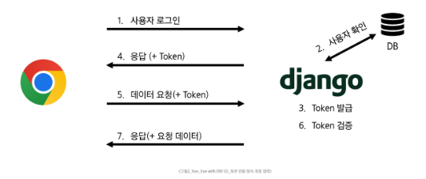

# Vue - Vue with DRF 02
# 인증 with DRF
## 사전 준비
- 인증 로직 진행을 위해 User 모델 관련 코드 활성화
- user ForeignKey 주석 해제
```python
# articles/models.py

class Article(models.Model):
    user = models.ForeignKey(
        settings.AUTH_USER_MODEL, on_delete=models.CASCADE
    )
    title = models.CharField(max_length=100)
    content = models.TextField()
    created_at = models.DateTimeField(auto_now_add=True)
    updated_at = models.DateTimeField(auto_now=True)
```
- serializers의 read_only_fields 주석 해제
```python
# articles/serializers.py

class ArticleSerializer(serializers.ModelSerializer):
    class Meta:
        model = Article
        fields = '__all__'
        read_only_fields = ('user',)
```
- article_list view 함수에서 게시글 생성시 user 정보도 저장될 수 있도록 주석 해제
```python
# articles/views.py

@api_view(['GET', 'POST'])
def article_list(request):
    ...
    elif request.method == 'POST':
        serializer = ArticleSerializer(data=request.data)
        if serializer.is_valid(raise_exception=True):
            # serializer.save()
            serializer.save(user=request.user)
            return Response(serializer.data, status=status.HTTP_201_CREATED)
```
1. DB 초기화
    - db.sqlite3 삭제
    - migrations 파일 삭제
2. Migration 과정 재진행
3. fixture의 articles.json은 user 정보가 없으므로 loaddata 불가
## 인증
### 인증의 필요성
- 클라이언트와 서버 간의 상태 정보를 유지하기 위해서 쿠키와 세션을 사용
- 하지만 클라이언트와 서버는 사용자를 식별하지 못하고 있는 상태
- 그래서 사용자를 식별하기 위해서 필요한 과정이 바로 인증(Authentication)
- 다양한 인증이 존재
  - 아이디와 비밀번호
  - 소셜 로그인(OAuth)
  - 생체 인증
- Django에서는 사용자 인증과 관련된 가장 중요하고 기본적인 뼈대를 제공(Django Authentication System)
### DRF에서의 인증
- 인증은 항상 view 함수 시작 시 다른 코드의 진행이 허용되기 전에 실행됨
  - 수신 요청을 해당 요청의 사용자 또는 해당 요청이 서명된 토큰과 같은 자격 증명 자료와 연결
- 이후 인증이 완료된 해당 자격 증명을 사용하여 권한 및 제한 정책을 확인하고, 요청을 허용해야 하는 지를 결정
- 인증 자체로는 들어오는 요청을 허용하거나 거부할 수 없으며, 단순히 요청에 사용된 자격 증명만 식별함에 유의
### 승인되지 않은 응답 및 금지된 응답
- 인증되지 않은 요청이 권한을 거부하는 경우 해당되는 두 가지 오류 코드를 응답
  1. HTTP 401 unauthorized
      - 요청에 유효한 인증 자격 증명(Authentication Credentials)이 없어 사용자를 식별할 수 없음을 의미(누구인지를 증명할 자료가 없음)
  2. HTTP 403 Forbidden(Permission Denied)
      - 서버에 요청이 전달되었지만, 권한 때문에 거절되었다는 것을 의미
      - 401과 다른 점은 서버는 클라이언트가 누구인지 알고 있음
## 인증 정책 설정
1. 전역 설정
2. View 함수 별 설정
### 1. 전역 설정
- 프로젝트 전체에 적용되는 기본 인증 방식을 정의
- DEFAULT_AUTHENTICATION_CLASSES를 사용
- 기본값: SessionAuthentication과 BasicAuthentication
- 사용 예시(DRF 공식 문서 참고)
```python
REST_FRAMEWORK = {
    'DEFAULT_AUTHENTICATION_CLASSES': [
        'rest_framework.authentication.BasicAuthentication',
        'rest_framework.authentication.TokenAuthentication',
    ],
}
```
### 2. View 함수 별 설정
- authentication_classes 데코레이터를 사용
- 개별 view에 지정하여 재정의
- 사용 예시(DRF 공식 문서 참고)
```python
from rest_framework.decorators import authentication_classes
from rest_framework.authentication import TokenAuthentication, BasicAuthentication

@api_view(['GET', 'POST'])
@authentication_classes([TokenAuthentication, BasicAuthentication])
def article_list(request):
    pass
```
### DRF가 제공하는 인증 체계
1. BasicAuthentication
    - 요청마다 사용자 이름과 비밀번호를 Base64로 인코딩하여 Authorization 헤더에 담아 보내는 방식
2. TokenAuthentication
    - 로그인 시 발급받은 고유한 토큰을 Authorization 헤더에 담아 요청함으로써 사용자를 인증하는 방식
3. SessionAuthentication
    - 장고의 기본 세션 시스템을 활용하여, 브라우저가 보내는 sessionid 쿠키를 통해 사용자를 인증하는 방식
4. RemoteUserAuthentication
    - 웹 서버 등 외부 시스템이 이미 처리한 인증 결과를 신뢰하고, 전달받은 사용자 이름으로 사용자를 인증하는 방식
### TokenAuthentication
- token 기반 HTTP 인증 체계
- 로그인 시 발급받은 고유한 토큰을 Authorization 헤더에 담아 요청함으로써 사용자를 인증하는 방식
- 기본 데스크톱 및 모바일 클라이언트와 같은 클라이언트-서버 설정에 적합
- 서버가 인증된 사용자에게 토큰을 발급하고 사용자는 매 요청마다 발급받은 토큰을 요청과 함께 보내 인증 과정을 거침
## Token 인증 설정
1. 인증 클래스 설정
2. INSTALLED_APPS 추가
3. Migrate 진행
### TokenAuthentication 적용 과정
1. 인증 클래스 설정
    - TokenAuthentication 활성화 코드 주석 해제
    - 전역 인증 정책을 Token 방식으로 설정
```python
# my_api/settings.py

REST_FRAMEWORK = {
    # Authentication
    'DEFAULT_AUTHENTICATION_CLASSES': [
        'rest_framework.authentication.TokenAuthentication',
    ],
}
```
2. INSTALLED_APPS 추가
    - rest_framework.authtoken 주석 해제
```python
# my_api/settings.py

INSTALLED_APPS = [
    'articles',
    'accounts',
    'rest_framework',
    'corsheaders',
    'rest_framework.authtoken',
    ...
]
```
3. Migrate 진행
```cmd
$ python manage.py migrate
```
### 토큰 인증 방식 과정 정리
#### 
## Dj-Rest-Auth 라이브러리
- 회원가입, 로그인/로그아웃, 비밀번호 재설정, 소셜 로그인 등 다양한 인증 관련 기능을 API 엔드포인트로 제공하는 라이브러리
- dj-rest-auth는 django.contrib.auth를 대체하는 것이 아니라, 그 위에 만들어져 기능을 확장
- 인증 기능을 RESTful API로 제공
### Dj-Rest-Auth 설치 및 적용
- 설치
```cmd
$ pip install dj-rest-auth
```
- 추가 App 주석 해제
```python
# my_api/settings.py

INSTALLED_APPS = [
    'articles',
    'accounts',
    'rest_framework',
    'corsheaders',
    'rest_framework.authtoken',
    'dj_rest_auth',
    ...
]
```
- 추가 URL 주석 해제
```python
# my_api/urls.py

urlpatterns = [
    path('admin/', admin.site.urls),
    path('api/v1/', include('articles.urls')),
    path('accounts/', include('dj_rest_auth.urls')),
]
```
### Dj-Rest-Auth의 Registration(등록) 기능 추가 설정
- 이전에 설치한 dj-rest-auth는 API 인터페이스를 제공하는 역할을 담당하며, 실제 로직 실행을 담당할 라이브러리를 추가로 설치
- 패키지 추가 설치
```cmd
$ pip install dj-rest-auth[with_social]
```
- 추가 App 주석 해제
```python
# my_api/settings.py

INSTALLED_APPS = [
    ...
    'django.contrib.sites',
    'allauth',
    'allauth.account',
    'allauth.socialaccount',
    'dj_rest_auth.registration',
    ...
]

SITE_ID = 1
```
#### ※ SITE_ID
- 사이트의 주소 정보를 찾는 데 사용하며, DB의 Site 테이블에서 설정한 ID 값에 매치되는 주소를 사용
- INSTALLED_APPS 목록의 Django.contrib.sites가 django_site 테이블을 자동으로 생성
---
- 관련 설정 코드 주석 해제
```python
# my_api/settings.py

MIDDLEWARE = [
    ...
    'allauth.account.middleware.AccountMiddleware',
]
```
- 추가 URL 주석 해제 후 Migrate 진행
```python
# my_api/urls.py

urlpatterns = [
    ...
    path('accounts/signup/', include('dj_rest_auth.registration.urls')),
]
```
```cmd
$ python manage.py migrate
```
- 회원가입 후 에러 메시지 출력 확인
  - 회원가입 후 이메일 발송되는데 이메일 서버를 설정하지 않아서 생기는 에러
- 관련 설정 코드 주석 해제
```python
# my_api/settings.py

ACCOUNT_EMAIL_VERIFICATION = 'none'
```
## Token 발급 및 활용
### Token 발급
- 회원가입 및 로그인을 진행하여 토큰 발급 테스트하기
- 라이브러리 설치로 인해 추가된 URL 목록 확인
  - http://127.0.0.1:8000/accounts/
- 회원가입 진행(DRF 페이지 하단 회원가입 form 사용)
  - http://127.0.0.1:8000/accounts/signup/
- 로그인 진행(DRF 페이지 하단 로그인 form 사용)
  - http://127.0.0.1:8000/accounts/login
- 로그인 성공 후 DRF로 부터 발급받은 Token 확인
- 이제 이 Token을 Vue에서 별도로 저장하여 매 요청마다 함께 보내야 함
### Token 활용
- 게시글 작성 과정을 통해 Token 사용 방법 익히기
- Postman을 활용해 게시글 작성 요청하기
  - http://127.0.0.1:8000/api/v1/articles/
  - Body에 게시글 제목과 내용 입력
- Headers에 발급받은 Token 작성 후 요청 성공 확인
  - Key: Authorization
  - Value: Token 토큰 값
### 클라이언트가 Token으로 인증받는 방법
1. Authorization HTTP Header에 포함
2. 키 앞에는 문자열 "Token"이 와야하며, 공백으로 두 문자열을 구분해야 함
### Token 데이터 확인
- Django DB 확인
- 발급받은 Token을 인증이 필요한 요청마다 함께 보내야 함
# 권한 with DRF
## 권한 정책 설정
1. 전역 설정
2. View 함수 별 설정
### 1. 전역 설정
- 프로젝트 전체에 적용되는 기본 권한 방식을 정의
- DEFAULT_PERMISSION_CLASSES를 사용
- 기본값: rest_framework.permissions.AllowAny
- 사용 예시(DRF 공식 문서 참고)
```python
REST_FRAMEWORK = {
    # Authentication
    'DEFAULT_PERMISSION_CLASSES': [
        'rest_framework.permissions.IsAuthentication',
    ],
}
```
### 2. View 함수 별 설정
- permission_classes 데코레이터를 사용
- 개별 view에 지정하여 재정의
- 사용 예시(DRF 공식 문서 참고)
```python
@api_view(['GET', 'POST'])
@permission_classes([IsAuthenticated])
def article_list(request):
    pass
```
## DRF가 제공하는 권한 정책
1. IsAuthenticated
    - 인증된(로그인한) 사용자만 접근을 허용
2. IsAdminUser
    - 스태프 권한(is_staff=True)을 가진 관리자 사용자만 접근을 허용
3. IsAuthenticatedOrReadOnly
    - 인증된 사용자는 모든 요청(읽기/쓰기)을 허용하고, 비인증 사용자는 읽기 전용 요청만 허용
4. AllowAny
    - 아무런 제한 없이 모든 사용자의 접근을 허용
### 1. IsAuthenticated
- 개념
  - 인증된 사용자만 접근을 허용하는 권한 클래스
  - 인증되지 않은 사용자의 모든 요청을 거부
- 특징
  - request.user가 존재하고 인증된 상태인지 확인
  - 보호해야 할 중요한 데이터나 리소스에 적합(예: 회원 전용 페이지, 결제, 프로필 수정 등)
### 2. IsAdminUser
- 개념
  - 관리자(is_staff=True) 권한을 가진 사용자만 접근을 허용하는 권한 클래스
  - 일반 사용자와 비인증 사용자의 모든 요청을 거부
- 특징
  - request.user.is_staff 속성값이 True인지 확인하여 권한을 검사
  - 회원 목록 조회, 데이터 통계 등 사이트 관리자에게만 노출되어야 하는 민감한 API에 적합
### 3. IsAuthenticatedOrReadOnly
- 개념
  - 비인증 사용자는 읽기만 허용하고, 인증된 사용자는 모든 요청(읽기, 쓰기)을 허용하는 권한 클래스
- 특징
  - 요청 메서드가 GET, HEAD, OPTIONS와 같은 안전한 메서드일 경우 무조건 허용하고, 그 외 메서드(POST, PUT 등)는 사용자의 인증 여부를 확인
  - 게시글 목록처럼 누구나 볼 수 있지만, 글 작성이나 수정은 회원만 가능한 API에 주로 적용
### 4. AllowAny
- 개념
  - 모든 요청을 무조건 허용하는 권한 클래스
  - 인증된 사용자든, 인증되지 않은 사용자든 상관없이 모두에게 접근을 허용
- 특징
  - 권한 검사(Authorization) 로직을 전혀 수행하지 않음
  - API 엔드포인트를 완전히 공개하고 싶을 때 사용
  - 보안이 필요한 리소스에는 부적합하므로, 회원가입, 로그인 또는 공개 게시글 조회 등 공개 API에 주로 적용
## IsAuthenticated 설정
- DEFAULT_PERMISSION_CLASSED 주석 해제
- 기본적으로 모든 View 함수에 대한 접근을 허용(AllowAny)
```python
# my_api/settings.py

REST_FRAMEWORK = {
    # Authentication
    'DEFAULT_AUTHENTICATION_CLASSES': [
        'rest_framework.authentication.TokenAuthentication',
    ],
    # # permission
    'DEFAULT_PERMISSION_CLASSES': [
        'rest_framework.permissions.AllowAny',
    ],
}
```
### 권한 활용하기
- 만약 관리자만 전체 게시글 조회가 가능한 권한이 설정되었을 때, 인증된 일반 사용자가 조회 요청을 할 경우 어떻게 되는지 응답 확인하기
- 테스트를 위해 임시로 관리자 관력 권한 클래스 IsAdminUser로 변경
```python
# articles/views.py

# permission Decorators
from rest_framework.decorators import permission_classes
from rest_framework.permissions import IsAdminUser

@api_view(['GET', 'POST'])
@permission_classes([IsAdminUser])
def article_list(request):
    pass
```
- 전체 게시글 조회 요청
  - http://127.0.0.1:8000/api/v1/articles/
- 403 Forbidden / 401 Unauthorized(Token 비활성화 후) 응답 확인
- IsAdminUser 삭제 후 IsAuthenticated 권한으로 복구
```python
# articles/views.py

from rest_framework.decorators import permission_classes
from rest_framework.permissions import IsAuthenticated

@api_view(['GET', 'POST'])
@permission_classes([IsAuthenticated])
def article_list(request):
    pass
```
- 정상 작동하던 게시글 전체 조회가 작동하지 않음
  - 401 status code 확인
- 게시글 조회 요청 시 인증에 필요한 수단(token)을 보내지 않고 있으므로 게시글 조회가 불가능해진 것