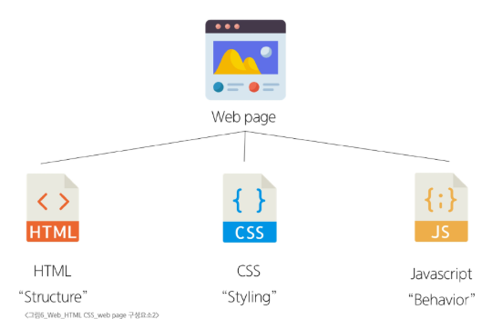
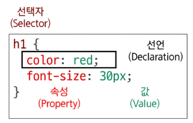

# Web - HTML & CSS
# 웹
- www
  - World Wide Web: 인터넷으로 연결된 컴퓨터들이 정보를 공유하는 거대한 정보 공간
- Web
  - Web site, Web application 등을 통해 사용자들이 정보를 검색하고 상호 작용하는 기술
- Web site
  - 인터넷에서 여러개의 Web paga가 모인 것으로, 사용자들에게 정보나 서비스를 제공하는 공간
- Web page
  - HTML, CSS 등의 웹 기술을 이용하여 만들어진 'Web site'를 구성하는 하나의 요소
- Web page 구성 요소
#### 
# 웹 구조화
## HTML
- HyperText Markup Language
- 웹 페이지의 의미와 구조를 정의하는 언어
### HyperText
- 웹 페이지를 다른 페이지로 연결하는 링크
  - 참조를 통해 사용자가 한 문서에서 다른 문서로 즉시 접근할 수 있는 텍스트
  - 비선형성 / 상호연결성 / 사용자 주도적 탐색
### Markup Language
- 태그 등을 이용하여 문서나 데이터의 구조를 명시하는 언어
  - 인간이 읽고 쓰기 쉬운 형태이며, 데이터의 구조와 의미를 정의하는 데 집중
  - ex) HTML, Markdown(프로그래밍 언어로 분류되진 않음)
## Structure of HTML
- \<!DOCTYPE html>
  - 해당 문서가 html로 작성된 문서라는 것을 나타냄
- \<html>\</html>
  - 전체 페이지의 콘텐츠를 포람
- \<title>\</title>
  - 브라우저 탭 및 즐겨찾기 시 표시되는 제목으로 사용
- \<head>\</head>
  - HTML 문서에 관련된 설명, 설정 등 컴퓨터가 식별하는 메타데이터를 작성
  - 사용자에게 보이지 않음
- \<body>\</body>
  - HTML 문서의 내용을 나타냄
  - 페이지에 표시되는 모든 콘텐츠를 작성
  - 한 문서에 하나의 body 요소만 존재
### HTML element
- 하나의 요소는 여는 태그과 닫는 태그, 그 안의 내용으로 구성
- 닫는 태그는 태그 이름 앞에 슬래시가 포함됨
  - 닫는 태그가 없는 태그도 존재
### HTML Attributes
- 사용자가 원하는 기준에 맞도록 요소를 설정하거나 다양한 방식으로 요소의 동작을 조절하기 위한 값
- 목적
  - 나타내고 싶지 않지만 추가적인 기능, 내용을 담고 싶을 때 사용
  - CSS에서 스타일 적용을 위해 해당 요소를 선택하기 위한 값으로 활용
- 작성 규칙
  1. 속성은 요소 이름과 속성 사이에 공백이 있어야 함
  2. 하나 이상의 속성들이 있는 경우엔 속성 사이에 공백으로 구분
  3. 속성 값은 열고 닫는 따옴표로 감싸야 함
---
- \<P>\</P>
  - Paragraph(문단)의 약자로, 텍스트 문단을 만드는 태그, 본문이라는 의미
- \<a>\</a>
  - Anchor(닻)의 약자로, 다른 페이지로 이동시키는 하이퍼링크 태그
  - href: 필수
- \\</img>
  - Image의 약자로, src에 지정된 그림을 보여주는 태그
  - alt: 대체 텍스트
## Text Structure
- 들여쓰기는 최종 출력에 영향을 주지 않음. 문법적으로는 의미 없음
- 탭 한번에 space(공백) 2개를 권장
- enter는 html에 존재하지 않음. 줄바꿈 태그(\<br>)을 따로 써야함
- 닫는 태그를 잘못 써도 에러를 일으키지 않음. 단지 이상한 동작을 수행
### HTML Text Structure
- HTML의 주요 목적 중 하나는 텍스트 구조와 의미를 제공하는 것
- 예를 들어 h1 요소는 단순히 텍스트를 크게만 만드는 것이 아닌 현재 문서의 최상의 제목이하는 의미를 부여하는 것
  - \<h1>Headig\</h1>
- 의미에 맞는 태그 사용은 스크린 리더, 검색 엔진 최적화(SEO)의 기본이 됨
  - 스크린 리더: 화면 내용을 소리로 읽어주는 프로그램
  - 검색 엔진 최적화(SEO): 검색 결과 상단에 내 사이트를 노출시켜 방문자를 늘리는 작업
### 대표적인 HTML Text structure
- Heading & Paragraph
  - h1~6, p
- Lists
  - ol(ordered list), ul(unordered list), li
- Empahsis & Importance
  - em(기울임), strong(굵게)
# 웹 스타일링
## CSS
- Cascading Style Sheet
- 웹 페이지의 디자인과 레이아웃을 구성하는 언어
### CSS 적용방법
1. Inline 스타일
   - HTML 요소 안에 style 속성 값으로 작성
2. Internal 스타일 시트
   - head 태그
3. External 스타일 시트
   - 별도 CSS 파일 생성 후 HTML link 태그를 사용해 불러오기
```html
<!DOCTYPE html>
<html lang="en">

<head>
  <meta charset="UTF-8">
  <meta name="viewport" content="width=device-width, initial-scale=1.0">
  <title>Document</title>
  <link rel="stylesheet" href="style.css">
  <style>
    h2 {
      color: red;
      background-color: black;
    }
  </style>
</head>

<body>
  <h1 style="color: blue; background-color: yellow;">Inline Style</h1>
  <h2>Internal Style</h2>
  <h3>External Style</h3>
</body>

</html>
```
---
```html
h3 {
  color: violet;
  background-color: green;
}
```
- 스타일 적용 우선 순위는 인라인 > 내부 > 외부 순으로 적용
- 인라인 스타일은 재사용이 어렵고 유지보수를 방해하니, 테스트나 특수한 경우에만 사용하는 것을 추천
## CSS 구문
### CSS 기본 구조와 문법
- 선택자(Selector)
  - '누구'를 꾸밀지 지정하는 부분
- 선언(Declaration)
  - '어떻게 꾸밀지에 대한 구체적인 한 줄의 명령
  - 속성과 값이 한 쌍으로 이루어지며, 세미콜론(;)으로 끝남
- 속성(Property)
  - 바꾸고 싶은 스타일의 종류를 나타냄
  - 스타일링하고 싶은 기능이나 특성을 의미
  - CSS가 미리 정의해 둔 키워드를 사용해야 함
- 값(Value)
  - 속성에 적용될 구체적인 설정
  - 속성이 받을 수 있는 값의 종류는 정해져 있음
  - 값의 단위
    - 키워드로 끝나는 값도 있지만, 크기나 간격을 나타낼 때는 단위가 필수적
    - 절대단위/상대단위
  - auto: 수평 정렬, 가운데로 유지, 수직은 적용 안됨
#### 
- 웹 디자인에서는 반응형 웹과 접근성 때문에 '상대 단위의 중요성'이 매우 높음
- 값이 0일 때는 단위를 생략하는 것이 권장됨
#### 절대 단위의 대표: 'px'
- 화면을 구성하는 가장 작은 단위인 '픽셀'을 기준으로 하는 절대 단위
- 모니터 해상도에 따라 크기가 결정되며, 직관적이고 예측이 쉬움
- 장점
  - 디자인 시안과 거의 동일한 결과물을 만들 수 있음
  - 요소의 크기를 명확하게 고정하고 싶을 때 유용
- 단점
  - 사용자가 브라우저의 기본 폰트 크기를 변경해도 요소의 크기가 함께 조절되지 않아 접근성에 불리
  - 다양한 디바이스 크기에 유연하게 대응하는 반응형 디자인에 한계가 있음
#### 상대 단위: 'em'
- 부모 요소의 폰트 사이즈를 기준으로 크기가 결정되는 상대 단위
- 만약 부모 요소에 폰트 사이즈가 없다면, 그 상위 부모의 폰트 사이즈를 상속 받음
- 장점
  - 부모 요소의 크기에 따라 자식 요소의 크기를 유연하게 조절할 수 있음
- 단점
  - 중첩 문제
  - em 단위를 사용하는 중첩되면 기준 크기가 계속 변경되어 계산이 복잡해지고 예측이 어려워짐
  - rem으로 해결
---
- 일관성 및 예측 가능성
  - 요소가 아무리 깊게 중첩되어도 기준은 항상 html이므로, em처럼 계산이 복잡해지지 않음
- 유지보수 용이성
  - html의 폰트 사이즈만 변경하면 사이트 전체의 레이아웃과 폰트 크기를 일관되게 조절할 수 있음
- 접근성 향상
  - 사용자가 브라우저에서 설정한 기본 폰트 크기를 html이 상속받으므로, 사용자의 설정에 밪춰 사이트 전체가 유연하게 확대/축소 됨
#### 
#### 상대 단위의 해결사: 'rem'
- Root em
- em의 단점을 극복하기 위해 등장
- 부모 요소가 아닌, 최상위 요소인 \<html>의 폰트 사이즈를 기준으로 크기가 결정
- html의 기본 폰트 사이즈는 대부분의 브라우저에서 16px
#### 
## CSS 선택자
- HTML 요소를 선택하여 스타일을 적용할 수 있도록 하는 선택자
### CSS Selectors 종류
- 기본 선택자
  - 전체 선택자(*)
    - HTML 모든 요소를 선택
  - 요소(tag) 선택자
    - 지정한 모든 태그를 선택
  - 클래스(class) 선택자('.'(dot))
    - 주어진 클래스의 속성을 가진 모든 요소를 선택
  - 아이디(id) 선택자('#')
    - 주어진 아이디 속성을 가진 요소 선택
    - 문서에는 주어진 아이디를 가진 요소가 하나만 있어야 함
  - 속성(attr) 선택자('[]'(대괄호))
    - 주어진 속성이나 속성값을 가진 모든 요소 선택
    - 속성의 존재 여부, 값의 일치/포함 등 다양한 조건으로 요소를 정교하게 선택 가능
- 결합자(Combinators)
  - 자손 결합자(" "(space))
    - 첫번째 요소의 자손 요소들 선택
    - ex) p span은 \<p> 안에 있는 모든 \<span>을 선택(하위 레벨 상관 없이)
  - 자식 결합자(">")
    - 첫번째 요소의 직계 자식만 선택
    - ex) ul > li은 \<ul> 안에 있는 모든 \<li>를 선택(한 단계 아래 자식들만)
## CSS 선언
- 선택된 요소에 적용할 스타일을 구체적으로 명시하는 부분
- 목적
  - 선택자는 '어떤 요소에' 스타일을 적용할 지 결정하는 규칙
  - 선택자 요소를 선택했으니, 이제 중괄호 {}안에 '무엇을'할 지 정의
  - 이 '무엇을'에 해당하는 부분이 바로 선언
## 명시도(Specificity)
- 결과적으로 요소에 적용할 CSS 선언을 결정하기 위한 알고리즘
  - CSS Selector에 가중치를 계산하여 어떤 스타일을 적용할지 결정
  - 동일한 요소를 가리키는 2개 이상의 CSS 규칙이 있는 경우, 가장 높은 명시도를 가진 Selector가 승리하여 스타일이 적용됨
### CSS
- Cascading Style Sheet
- 웹 페이지의 디자인과 레이아웃을 구성하는 언어
### Cascade
- 계단식
- 한 요소에 동일한 가중치를 가진 선택자가 적용될 때
- CSS에서 가장 마지막에 나오는 선언이 사용됨
### 명시도가 높은 순
1. Importance
   - !important: 다른 우선순위 규칙보다 우선하여 적용하는 키워드
     - Cascade의 구조를 무시하고 강제로 스타일을 적용하는 방식이므로 사용을 권장하지 않음
2. Inline 스타일
3. 선택자
   - id 선택자 > class 선택자 > 요소 선택자
4. 소스 코드 선언 순서
## 상속
### CSS 상속
- 기본적으로 CSS는 상속을 통해 부모 요소의 속성을 자식에게 상속해 재사용성을 높임
- 상속되는 속성
  - Text 관련 요소
- 상속되지 않는 속성
  - Box model 관련요소
  - position 관련 요소
# CSS Box Model
- 웹 페이지의 모든 HTML 요소를 감싸는 사각형 상자 모델
## 박스 구성 요소
- margin(외부 간격): 이 박스와 다른 요소와의 외부 간격
- border(테두리): content와 padding을 갑싸는 테두리
- padding(안쪽 여백): content와 border사이의 내부 여백
- content(내용): 실제 내용이 위치하는 영역
### Box 구성의 방향 별 속성 값
#### 
## shorthand 속성(단축 속성)
- 작성 순서는 영향을 주지 않음
### border
- border-width, border-style, border-color를 한번에 설정하기 위한 속성
### shorthand 속성: margin & padding
- 4방향의 속성을 각각 지정하지 않고 한번에 지정할 수 있는 속성
```html
/* 4개 - 상우하좌 */
margin: 10px 20px 30px 40px;
padding: 10px 20px 30px 40px;

/* 3개 - 상/좌우/하 */
margin: 10px 20px 30px;
padding: 10px 20px 30px;

/* 2개 - 상하/좌우 */
margin: 10px 20px;
padding: 10px 20px;

/* 1개 - 공통 */
margin: 10px;
padding: 10px;
```
## box-sizing 속성(박스의 크기 계산법)
border좌우 + padding좌우 + content
### The standard CSS box model
1. 표준 상자 모델에서 width와 height 속성 값을 설정하면, 이 값은 content box의 크기를 조정하게 됨
2. CSS는 border box가 아닌 content box의 크기를 width 값으로 지정
### The alternative CSS box model
- 대체 상자 모델에서 모든 width롸 height는 실제 상자의 너비
- 실제 박스 크기를 정하기 위해 테두리와 패딩을 조장할 필요 없음
```html
* {
  box-sizing: border-box;
}
```
# 참고
## 명시도 관련
## HTML 스타일 가이드
- 대소문자 구분
  - HTML은 대소문자를 구분하지 않지만, 소문자 사용을 강력히 권장
  - 태그명과 속성명 모두 소문자로 작성
- 속성 따옴표
  - 속성 값에는 큰 따옴표("")를 사용하는 것이 일반적
- 코드 구조와 포맷팅
  - 일관된 들여쓰기 사용(보통 2칸 공백)
  - 각 요소는 한 줄에 하나씩 작성
  - 중첩된 요소는 한 단계 더 들여쓰기
- 공백 처리
  - HTML은 연속된 공백을 하나로 처리
  - Enter 키로 줄 바꿈을 해도 브라우저에서 인식하지 않음(줄 바꿈 태그를 사용해야함)
- 에러 출력 없음
  - HTML은 문법 오류가 있어도 별도의 에러 메시지를 출력하지 않음
## CSS 스타일 가이드
- 코드 구조와 포맷팅
  - 일관된 들여쓰기를 사용(보통 2칸 공백)
  - 선택자와 속성은 각각 새 줄에 작성
  - 중괄호 앞에 공백 넣기
  - 속성 뒤에는 콜론(:)과 공백 넣기
  - 마지막 속성 뒤에는 세미콜론(;) 넣기
- 선택자 사용
  - class 선택자를 우선적으로 사용
  - id, 요소 선택자 등은 가능한 피할 것
    - 여러 선택자들과 함께 사용할 경우 우선순위 규칙에 따라 예기치 못한 스타일 규칙이 적용되어 전반적인 유지보수가 어려워지기 때문
- 속성과 값
  - 속성과 값은 소문자로 작성
  - 0 값에는 단위를 붙이지 않음
- 명명 규칙
  - 클래스 이름은 의미있고 목적을 나타내는 이름을 사용
  - kebab-case를 사용
  - 약어보다는 전체 단어를 사용
- CSS 적용 스타일
  - 인라인 스타일은 되도록 사용하지 말 것
    - CSS와 HTML 구조 정보가 혼합되어 작성되기 때문에 코드를 어렵게 만듦
## MDN
- Mozilla Developer Network에서 제공하는 온라인 문서로, 웹 개발자와 디자이너를 위한 종합적인 참고 자료
- HTML, CSS, JavaScript, 웹 API, 개발 도구 등 웹 기술에 대한 정보를 제공
### MDN 문서를 활용해야하는 이유
- 정확성 및 신뢰성
  - Mozilla와 웹 커뮤니티의 전문가들에 의해 작성되고 유지 관리
  - 웹 표준을 정확하게 반영하고 있으며, 신뢰할 수 있는 정보 소스를 제공
- 최신 웹 기술
  - 최신 웹 표준과 기술을 다루고 있어, 웹 개발자들이 최신 정보를 쉽게 접할 수 있음
- 명확한 설명과 예제
  - 복잡한 개념을 이해하기 쉽게 설명하고, 실습 가능한 예제 코드를 제공
### MDN 문서의 중요성
- MDN 문서는 웹 개발 학습의 모든 단계에서 중요한 참고 자료
- 개발 과정에서 발생하는 다양한 문제에 대한 솔루션을 찾는 데 유용
- 이 문서를 활용함으로써, 웹 기술에 대한 깊은 이해를 얻고, 실무에 필요한 능력을 갖출 수 있음