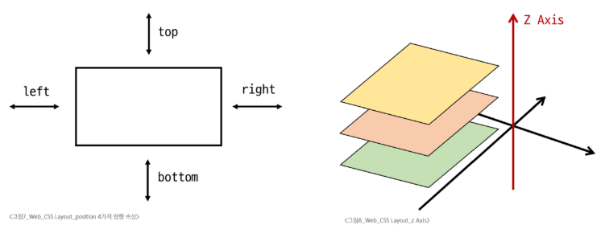
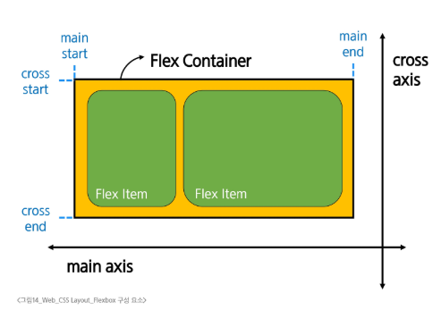

# Web - CSS Layout
# CSS Box Model
## display 속성(박스의 화면 배치 방식)
### 박스 타입
- 박스 타입에 따라 페이지에서의 배치 흐름 및 다른 박스와 관련하여 박스가 동작하는 방식이 달라집
### 박스 타입 종류
1. Block 타입
   - 항상 새로운 행으로 나뉨(한 줄 전체를 차지, 너비 100%)
   - width, height, margin, padding 속성을 모두 사용할 수 있음
   - padding, margin, border로 인해 다른 요소를 상자로부터 밀어냄
   - width 속성을 지정하지 않으면 박스는 inline 방향으로 사용 가능한 공간을 모두 차지
     - 상위 컨테이너 너비 100%로 채우는 것
   - 대표적인 block 타입 태그
     - h1~6, p, div, ul, li
#### block 타입의 대표: div
- 다른 HTML 요소들을 그룹화하여 레이아웃을 구성하거나 스타일링을 적용할 수 있음
- 헤더, 푸터, 사이드바 등 웹 페이지의 다양한 섹션을 구조화하는 데 가장 많이 쓰이는 요소
2. Inline 타입
   - 줄바꿈이 일어나지 않음(콘텐츠의 크기만큼만 영역을 차지)
   - width와 height 속성을 사용할 수 없음
   - 수직 방향(상하)
     - padding, margin, border가 적용되지만, 다른 요소를 밀어낼 수는 없음
   - 수평 방향(좌우)
     - padding, margin, border가 적용되어 다를 요소를 밀어낼 수 있음
   - 대표적인 inline 타입 태그
     - a, img, span, strong
#### inline 타입의 대표: span
- 자체적으로 시각적 변화 없음
  - 스타일을 적용하기 전까지는 특별한 변화 없음
- 텍스트 일부 조작
  - 문장 내 특정 단어나 구문에만 스타일을 적용할 때 유용
- 블록 요소처럼 줄바꿈을 일으키지 않으므로, 문서의 구조에 큰 변화를 주지 않음
## Normal flow
- 일반적인 흐름 또는 레이아웃을 변경하지 않은 경우 웹 페이지 요소가 배치되는 방식
- 블록은 한 줄 전체를, 인라인은 콘텐츠만큼의 공간만 차지하며 줄을 바꾸지 않음
## 기타 display 속성
1. inline-block
   - inline과 block의 특징을 모두 가진 특별한 display 속성 값(줄바꿈 없이, 크기 지정 가능)
   - width 및 height 속성 사용 가능
   - padding, margin 및 border로 인해 다른 요소가 상자에서 밀려남
#### ※ 주로 가로로 정렬된 내비게이션 메뉴나 여러 개의 버튼, 이미지 갤러리 처럼 수평으로 나열하면서, 각 항목의 크기를 직접 제어하고 싶을 때 매우 유용하게 사용 됨
2. none
   - 요소를 화면에 표시하지 않고, 공간조차 부여되지 않음
3. flex
# CSS position
- CSS Layout
  - 각 요소의 위치와 크기를 조정하여 웹 페이지의 디자인을 결정하는 것
  - 요소들을 상하좌우로 정렬하고, 간격을 맞추고, 전체적인 페이지의 뼈대를 구성
  - 핵심 속성: display(block, inline, flex, grid 등)
- CSS Position
  - 요소를 Normal Flow에서 제거하여 다른 위치로 배치하는 것
  - 다른 요소 위에 올리기, 화면의 특정 위치에 고정시키기 등
  - 핵심 속성: position(static, relative, absolute, fixed, sticky 등)
- Position 이동 방향
  - 네 가지 방향 속성(상하좌우)를 이용해 요소의 위치를 조정 할 수 있음
  - 겹치는 요소의 쌓이는 순서를 조절할 수 있음
#### 
## Position 유형
1. static
   - 요소를 Normal Flow에 따라 배치
   - top, right, bottom, left 속성이 적용되지 않음
   - 기본 값
2. relative
   - 요소를 Normal Flow에 따라 배치
   - 자신의 원래 위치(static)을 기준으로 이동
   - top, right, bottom, left 속성으로 위치 조정
   - 다른 요소의 레이아웃에 영향을 주지 않음(요소가 차지하는 공간은 static일 때와 같음)
3. absolute
   - 요소를 Normal Flow에서 제거
   - 가장 가까운 relative 부모 요소를 기준으로 이동
     - 만족하는 부모 요소가 없다면 body 태그를 기준으로 함
   - top, right, bottom, left 속성으로 위치를 조정
   - 문서에서 요소가 차지하는 공간이 없어짐
4. fixed
   - 요소를 Normal Flow에서 제거
   - 현재 화면영역(veiwport)을 기준으로 이동
   - 스크롤해도 항상 같은 위치에 유지됨
   - top, right, bottom, left 속성으로 위치를 조정
   - 문서에서 요소가 차지하는 공간이 없어짐
5. sticky
   - relative와 fixed의 특성을 결합한 속성
   - 스크롤 위치가 입계점에 도달하기 전에는 relative처럼 동작
   - 스크롤 위치가 임계점에 도달하면 fixed처럼 화면에 고정
   - 다음 sticky 요소가 나오면 이전 sticky 요소의 자리를 대체
     - 이전 sticky 요소와 다음 sticky 요소의 위치가 겹치게 되기 때문
## z - index
- 정수 값을 사용해 Z축 순서를 지정
- 값이 클수록 요소가 위에 쌓이게 됨
- static이 아닌 요소에만 적용됨
- 기본값은 auto로 부모 요소의 z-index값에 영향을 받음
- 같은 부모 내에서만 z-index 값을 비교하고, 값이 같으면 HTML 문서 순서대로 쌓임
- 부모의 z-index가 낮으면 자식의 z-index가 아무리 높아도 부모보다 위로 올라갈 수 없음
# CSS Flexbox
- 요소를 행과 열 형태로 배치하는 1차원 레이아웃 방식
- 박스 표시(Display) 타입
1. Outer display 타입
   - block 타입
   - inline 타입
2. Inner display 타입
   - 박스 내부의 요소들이 어떻게 배치될지를 결정
   - CSS Flexvox(속성: flex)
## Flexbox 구성 요소
### main axis(주 축)
- flex item들이 배치되는 기본 축
- main start에서 시작하여 main end 방향으로 배치(기본 값)
### cross axis(교차 축)
- main axis에 수직인 축
- cross start에서 시작하여 cross end 방향으로 배치(기본 값)
### flex container
- display: flex; 혹은 display: inline-flex; 가 설정된 부모 요소
- 이 컨테이너의 1차 자식 요소들이 Flex Item이 됨
- flexbox 속석 값들을 사용하여 자식 요소 Flex Item들을 배치하는 주체
### flex item
- Flex Container 내부에 레이아웃 되는 항목
- 이후 자유로운 순서 변경 및 정렬 가능
#### 
## Flexbox 속성
## flex-wrap 응용
# 참고
## 마진 상쇄
## 박스 타입 별 수평 정렬
## 실제 Position 활용 예시
## Flexbox Shorthand 속성
## Flexbox 속성 정리