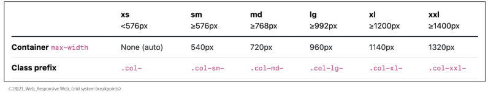

# Web - Responsive Web
# Bootstrap Grid system
- 웹페이지의 레이아웃을 조정하는 데 사용되는 12개의 컬럼으로 구성된 시스템
- 반응형 디자인을 지원해 웹 페이지를 모바일, 태블릿, 데스크탑 등 다양한 기기에서 적절하게 표시할 수 있도록 도와줌
#### ※ 반응형 웹 디자인(Responsive Web Design)
- 디바이스 종류나 화면 크기에 상관없이, 어디서든 일관된 레이아웃 및 사용자 경험을 제공하는 디자인 기술
- 32인치 모니터, 태블릿, 스마트폰 등, 화면 크기에 따라 요소릐 배치를 변경하여 일관된 사용자 경험을 제공할 수 있음
## Grid system 구조
### Grid system 기본 요소
- Container
  - column들을 담고 있는 공간
- Column
  - 실제 컨텐츠를 포함하는 부분
- Gutter
  - 컬럼과 컬럼 사이의 여백 영역(상하좌우)
- 1개의 row 안에 12개의 column 영역이 구성
  - 각 요소는 12개 중 몇 개를 차지할 것인지 지정 됨
```html
<div class="container">
  <div class="row">
    <div class="col-4"></div>
    <div class="col-4"></div>
    <div class="col-4"></div>
  </div>
</div>
```
### Grid system 실습
- Column
  - 기본, nesting, offset
- Gutters
  - Grid system에서 column 사이에 여백 영역
  - x축은 padding, y축은 margin으로 여백 생성
  - 실제 컬럼 간에 좌우 간격(x축)은 변하지 않으며 padding으로 인해 컬럼안에 contents의 너비가 변함
# Grid system for responsive web
- Responsive Web Design
  - 디바이스 종류나 화면 크기에 상관없이, 어디서든 일관된 레이아웃 및 사용자 경험을 제공하는 디자인 기술
  - Bootstrap grid system에서는 12개의 column과 6개의 breakpoints를 사용하여 반응형 웹 디자인을 구현
## Grid system Breakpoints
- 웹 페이지를 다양한 화면 크기에서 적절하게 배치하기 위한 분기점
  - 화면 너비에 따라 6개의 분기점 제공(xs, sm, md, lg, xl, xxl)
#### 
- 각 breakpoints 마다 설정된 최대 너비 값 '이상으로' 화면이 커지면 grid system 동작이 변경됨
## Breakpoints 실습
- 실제 Bootstrap에 Grid system 코드는 Media Query로 작성됨
# CSS Layout 종합 정리
- position
- flex
- grid system
# UX & UI
## UX
- User Experience
- 제품이나 서비스를 사용하는 사람들이 느끼는 전체적인 경험과 만족도를 개선하고 최적화하기 위한 디자인과 개발 분야
- UX 예시
  - 백화점 1층에서 느껴지는 좋은 향수 향기
  - 러쉬 매장 근처만 가도 맡을 수 있는 러쉬 향기
  - 원하는 음악을 검색할 때, 검색 기능이 적절하게 작동하고 검색 결과가 정확하게 나오는 것
- UX 설계
  - 사람들의 마음과 생각을 이해하고 정리해서 제품에 녹여내는 과정
  - 유저 리서치, 데이터 설계 및 정제, 유저 시나리오, 프로토타입 설계
## UI
- User Interface
- 서비스와 사용자 간의 상호작용을 가능하게 하는 디자인 요소들을 개발하고 구현하는 분야
- UI 예시
  - 리모콘: 사용자가 버튼을 누르면 TV가 켜지고, 채널을 변경하거나 볼륨을 조절할 수 있음
  - ATM: 사용자가 터치스크린을 통해 사용자 정보를 입력하고, 원하는 금액을 선택할 수 있음
  - 웹 사이트: 사용자가 로그인 버튼을 누르면, 이동하는 화면의 디자인 및 레이아웃
- UI 설계
  - 예쁜 디자인 보다는 사용자가 더 쉽고 편리하게 사용할 수 있도록 고려
  - 이를 위해서는 디자인 시스템, 중간 산출물, 프로토타입 등이 필요
### 디자이너와 기획자 그리고 개발자
- UX(직무: UX Researcher, User Researcher)
  - 구글: 사용자의 경험을 이해하기 위한 통계 모델을 설계
  - MS: 리서치를 기획하고 사용자에 대한 지표를 정의
  - Meta: 정성적인 방법과 정량적인 방법을 사용해서 사용자 조사를 실시
- UI(직무: Product Designer, Interaction Designer)
  - 구글: 다양한 디자인 프로토타이핑 툴을 사용해서 개발 가이드를 제공
  - MS: 시각 디자인을 고려해서 체계적인 디자인 컨셉을 보여줌
  - Meta: 제품을 이해하고 더 나은 UI Flow와 사용자 경험을 디자인
# 참고
## The Grid System
- CSS가 아닌 편집 디자인에서 나온 개념. 구성 요소를 잘 배치해서 시각적으로 좋은 결과물을 만들기 위함
- 기본적으로 안쪽에 있는 요소들의 오와 열을 맞추는 것에서 기인
- 정보 구조와 배열을 체계적으로 작성하여 정보의 질서를 부여하는 시스템
## Grid cards
- row-cols 클래스를 사용하여 행당 표시할 열(카드) 수를 손쉽게 제어할 수 있음
## UI Design Guidelines
### 기업별 UI Design Guidelines
- 삼성(One UI)
  - https://developer.samsung.com/one-ui
- 애플(Design guide)
  - https://developer.apple.com/kr/design/tips/
- 구글(Material Design)
  - https://m3.material.io/