# PJT 10
# 프로젝트 기획과 설계
- 기획(Planning): 프로젝트 목표와 전략을 수립하는 과정
- 설계(Design): 기획된 목표를 구현하기 위한 구조와 방법을 정의하는 과정
## 개요
### 요구사항 분석
- 사용자와 이해 관계자의 필요, 요구를 수집하고 명세화하는 과정이 필요
  - 무엇을, 어떻게 해야하는지를 정의
  - 기획 단계에서 설정된 목표를 구체적 실행 계획으로 전환
  - 설계 단계의 정확성과 효율성 확보
- 기능적 요구사항
  - 회원은 이메일로 가입할 수 있어야 함
  - 상품 목록을 페이지네이션해서 보여줘야 함
- 비기능적 요구사항
  - 초기 로딩 시간은 3초 이내여야 함
### 요구사항 분석을 위해서
- 핵심 기능 식별
  - 시스템이 꼭 해야 할 기능과 추가될 수 있는 기능을 구분
  - 기능 우선 순위를 매겨, 무엇부터 구현할지 결정
- 사용자 정의
  - 사용자 유형(페르소나)을 설정
  - 그들이 서비스를 어떻게 사용할 지(사용자 여정)를 파악
- 제약 사항 파악
  - 기술(사용할 스택), 일정(개발 기간), 예산, 법적 요건 등
### 아키텍처와 기술 스택 결정
- Djanfo(Template with Vue)
  - CDN 방식이면 컴포넌트화 해서 모듈을 사용하기 어려워짐 -> 싱글 페이지 형태, 자바 스크립트로 직접 비동기 요청 작성
- DRF + Vue
  - RESTful한 개발 환경 경험 필수
- 아키텍처 결정의 의미
  - 유지 보수성(코드 가독성)과 확장성 확보
    - 팀 역할 분담 명확화
  - 스택 선택 기준
    - 학습 곡선
    - 커뮤니티 지원
    - 성능
- 라이브러리 선정(Vue 기준)
  - 우리 프로젝트에 Vue Router 도입이 필수적일까?
    - 페이지 전환 빈도는 어느 정도인가?
    - 화면간 이동이 많고, URL 공유 기능 등을 구현하고자 한다면
    - 동적, 중첩 라우팅 기술이 필요한가?
### 프로젝트 구조 및 코드 컨벤션
- 코드 가독성 / 유지 보수성을 확보
- 팀원 간 협업 시 혼선을 최소화하여 업무의 효율화
- Django 프로젝트
  - views.py, models.py, serializers.py 등
- Vue 프로젝트
  - components/, views/, stores/, router/, assets/ 등
- 외에도 필요에 따라 각 기능별(app 별)로 폴더의 구조화 작업
- 네이밍 컨벤션
  - 요청에 대한 응답 데이터의 네이밍 컨벤션을 준수하여 업무 효율성 증가
  - 컴포넌트 명 작성 방식의 컨벤션을 정하여 협업 시 작업 편의성 증가
  - 핵심 포인트: 일관된 스타일 유지
- git commit 컨벤션
  - feat: 새로운 기능 추가
  - fix: 버그 수정
  - docs: 문서 수정(README)
  - style: 코드 포맷 수정(코드 동작에 영향 없음)
  - retactor: 코드 구조 개선
## 프로젝트 세부 설계
### Vue 프로젝트 세부 설계 과정
1. 라우팅 설계
2. 컴포넌트 분리 및 책임 정의
3. API 설계 및 연동 구조
4. UI/UX 스타일 가이드
5. GIT flow
6. 문서화
### 1. 라우팅 설계
- 기능 구현에 필요한 최소한의 Route Tree 구성
- 중첩 라우팅(Nested) vs 단일 라우팅 결정
- 라우터 가드 전략 세우기
- RESTful URL 설계
#### 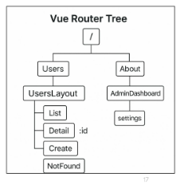
- URL에서의 중첩된 관계를 표현하는 과정
#### 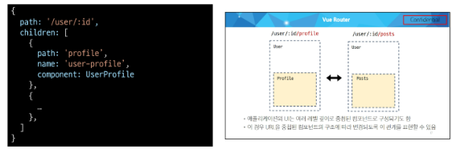
1. Globally(전역 가드)
    - 애플리케이션 전역에서 모든 라우트 전환에 적용되는 가드
2. Per-route(라우터 가드)
    - 특정 라우트에만 적용되는 가드
3. in-component(컴포넌트 가드)
    - 컴포넌트 내에서만 적용되는 가드
#### 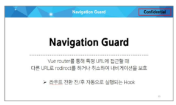
1. 자원의 식별
    - URI
2. 자원의 행위
    - HTTP Methods
3. 자원의 표현
    - JSON 데이터
    - 궁극적으로 표현되는 데이터 결과물
#### 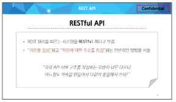
### 2. 컴포넌트 분리 및 책임 정의
- View 컴포넌트 vs UI 컴포넌트 구분
- 하나의 컴포넌트는 하나의 역할만 책임
- Props/Emits 설계
  - 데이터의 소유 주체를 명확히 하기
#### 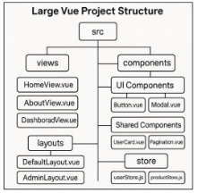
#### 
### 3. API 설계 및 연동 구조
- Back-End API 문서화
  - 응답 데이터 명세서 작성
- AJAX 기술 결정
  - 공통 인스턴스 설정(API_URL, headers 등)
  - 올바른 예외 / 에러 처리
#### 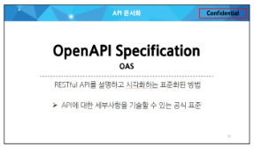
#### 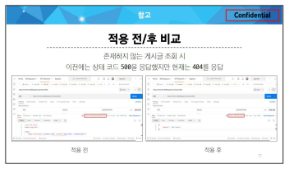
### 4. UI/UX 스타일 가이드
- 디자인 시스템
  - 컬러, 타이포그래피, Spacing 정리
  - 응답 데이터 명세서 작성
- 전역 CSS vs Scoped CSS
- 공통 레이아웃(Header, Footer) 컴포넌트
- 스타일 가이드 문서(Figma)
### 6. 문서화
- 일정 계획 수립
  - WBS(Work Breakdown Structure)
    - 프로젝트를 큰 목표부터 작은 작업 단위까지 계층적으로 나누어 정리한 구조
    - 프로젝트 범위와 목표를 정하고, 각 단계의 결과물을 나열하여 작업을 할당
    - 담당자 배정과 일정 관리를 위해 사용
  - Gantt Chart
    - 프로젝트 일정을 타임 라인으로 나열하여, 프로젝트 기간, 진행률을 나타내는 표현 방법
    - WBS와 함께 작성하여 프로젝트 진행사항을 한 눈에 파악할 수 있음
# 데이터 가공 및 저장
## 데이터셋
### 카테고리 데이터셋(aladin_Gategory_CID_20210927.xls)
- 2021년 기준 알라딘에서 제공하는 CID 목록
## 데이터 가공
### 카테고리 맵핑
- 데미안 categoryId(50922)의 카테고리명은 독일소설
- aladin_Category_CID.xls -> 총 4781개의 카테고리 아이디(CID)
- 카테고리 기반 필터링 기능 구현 시, 4781개의 선택 옵셥이 있다면 UX에 바람직하지 않음
- 1 Depth를 기준으로 CID를 묶어 카테고리 필터링을 구현하자
#### 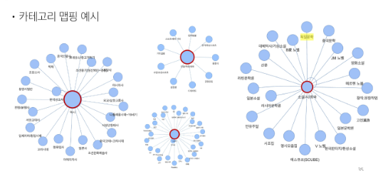
1. 엑셀 파일 읽기
    - 3번째 행을 헤더로 사용하여 데이터 읽기
2. 1 Depth 값을 기준으로 CID 그룹핑
    1. 빈 딕셔너리(category_dict) 생성, 1 Depth 값을 Key로, CID 값을 리스트에 담아 Value로 저장
    2. category_dict의 각 Key에 PK 부여
### step0: 패키지 설치
- 정형 데이터(테이블 데이터) 작업을 위한 pandas 설치
- 엑셀 파일을 읽고, 쓰기 위한 패키지 openpyxl 설치
```cmd
pip install pandas

pip install openpyxl
```
### step1: 엑셀 파일 읽기
- pandas의 read_excel 메서드로 엑셀 파일 읽기
  - 지원 파일 형식: xls, xlsx, xlsm, xlsb, odf, ods and odt
  - header=2: 첫 2행은 건너뛰고 3번째 행을 헤더로 사용
```python
import pandas as pd

df = pd.read_excel(excel_file, header=2)
```
### step2: 1 Depth 값을 기준으로 CID 그룹핑
- 빈 딕셔너리(category_dict) 생성
- iterrows 메서드로 각 row의 index와 row 조회
  - 각 row의 1Depth, CID 컬럼 값을 category, cid에 할당
```python
category_dict = {}

for index, row = in df.iterrows():
    category = row['1Depth']
    cid = row['CID']
```
- isna 메서드로 category 값이 결측값(빈 값) 여부 확인
- category_dict의 category 존재 여부 확인 후 리스트에 cid 저장
```python
category_dict = {}

for index, row in df.iterrows():
    category = row['1Depth']
    cid = row['CID']
    # 카테고리 값이 NaN인 경우는 무시
    if pd.isna(category):
        continue
    
    # 카테고리별로 CID를 리스트에 추가
    if category in category_dict:
        category_dict[category].append(cid)
    else:
        category_dict[category] = [cid]
```
- 총 33개의 카테고리 생성
- 각 카테고리별 CID
#### 
- 각 그룹에 PK 부여
  - enumerate와 items를 사용해 pk, name, cid_list를 키로 둔 딕셔너리 생성
```python
new_groups = []
for idx, (cat, cid_list) in enumerate(category_dict.items(), start=1):
    new_groups.append({
        'pk': idx,
        'name': cat,
        'cid_list': cid_list
    })
```
- 각 그룹에 PK 부여
  - 총 33개의 그룹 생성
#### 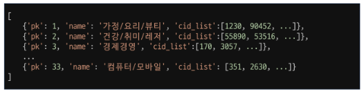
### step3: 새로운 그룹핑
- 33개의 그룹 -> 7개 그룹 병합(자유롭게 병합 가능)
#### 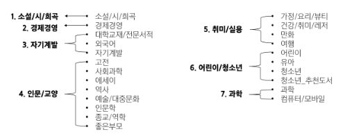
- 새로운 그룹 정의
  - 기존 pk들을 리스트(old_pks) 형태로 지정
```python
new_group_mapping = {
    1: {"name": "소설/시/희곡", "old_pks": [12]},
    2: {"name": "경제/경영", "old_pks": [3]},
    3: {"name": "자기계발", "old_pks": [9, 19, 23]},
    4: {"name": "인문/교양", "old_pks": [5, 11, 15, 17, 18, 21, 27, 28]},
    5: {"name": "취미/실용", "old_pks": [1, 2, 10, 16]},
    6: {"name": "어린이/청소년", "old_pks": [14, 20, 30, 31]},
    7: {"name": "과학", "old_pks": [6, 33]},
}
```
- 그룹 병합
  - extend 메서드로 기존 그룹의 CID(cid_list) 병합
```python
final_groups = []
for new_pk, mapping_data in new_group_mapping.items():
    merged_cid_list = []
    for old_pk in mapping_data["old_pks"]:
        # new_groups 리스트에서 pk가 old_pk와 일치하는 항목을 찾음
        for group in new_groups:
            if group["pk"] == old_pk:
                merged_cid_list.extend(group["cid_list"])
                break
    final_groups.append({
        "pk": new_pk,
        "name": mapping_data["name"],
        "cid": merged_cid_list
    })
```
### step4: categories.json 저장
- 최종 그룹 저장
  - 한글 깨짐 방지를 위한 ensure_ascii=False
```python
with open(json_file, 'w', encoding='utf-8') as f:
    json.dump(final_groups, f, ensure_ascii=False, indent=4)
```
## 데이터 추출
- 새롭게 묶은 7개의 카테고리 PK에 맞춰 categoryId를 바꾸자
- 이번 프로젝트에선 카테고리별 도서 10권만 필요한 내용을 추출해 사용하자
### categoryId 맵핑 및 추출
1. 데미안 cateforyId(50922)를 categories.json의 cid에 맞춰 맵핑
#### 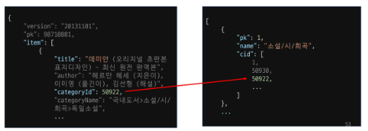
#### 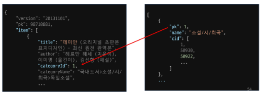
2. 카테고리 별 도서 10권의 필요한 필드만 추출
#### 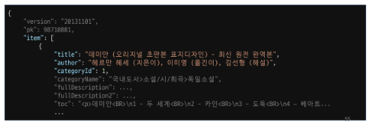
### categoryId 맵핑 및 추출 pseudocode
1. books_raw.json, categories.json 파일 읽기
2. 카테고리별 추출된 도서를 저장할 리스트(extracted_book), 카테고리별 추출된 도서 수를 추적할 딕셔너리(category_counts) 생성
3. 카테고리별 도서 추출 및 categoryId 맵핑
    1. 각 도서의 categoryId가 categories.json의 어떤 카테고리에 해당하는지 cid 조회
    2. cid가 있는 카테고리의 도서가 현재까지 몇권 추출됐는지 확인
    3. 10권 이하라면 해당 도서의 categoryId를 해당 category의 pk로 맴핑 후 extracted_book에 저장, category_counts의 해당 카테고리 값 +1
4. extracted_book을 JSON으로 저장
### step1: JSON 파일 읽기
- books_raw.json과 categories.json 데이터 로드
```python
with open(raw_json_file, "r", encoding="utf-8") as f:
    books = json.load(f)
with open(category_json_file, "r", encoding="utf-8") as f:
    categories = json.load(f)
```
### step2: 추출 준비
- 카테고리별 추출된 도서 수를 추적할 딕셔너리(category_counts)
- 카테고리별 추출된 도서를 저장할 리스트(extracted_book) 생성
  - 각 도서에게 부여할 fixture_pk 준비
```python
category_counts = {category["pk"]: 0 for category in categories}

extracted_books = []
fixture_pk = 1
```
### step3: 도서 데이터 조회 - 맵핑 - 추출
- 도서의 fields 중 categoryId 값을 get 메서드로 찾아 int로 반환(orig_cat_int)
- orig_cat_int가 어떤 category의 cid 리스트 안에 존재하는지 조회
```python
for book in books:
    item = book.get("item", {})
    fields = item[0]            
    orig_cat = fields.get("categoryId")
    orig_cat_int = int(orig_cat)
    
    for category in categories:
        cid_list = category.get("cid", [])
        if orig_cat_int in cid_list:
            # 3-2. 해당 카테고리에서 현재까지 추출된 도서 수 확인
            cat_pk = category.get("pk")
```
- 일치하는 카테고리를 찾았다면, 현재까지 몇 권의 도서가 추출됐는지 조회
  - category_counts의 해당 카테고리 value가 10 이하인지 확인 후, 10 이하 시 category를 해당 카테고리 pk(cat_pk)로 맵핑
```python
for book in books:
    ...
    
    for category in categories:
        cid_list = category.get("cid", [])
        if orig_cat_int in cid_list:
            # 3-2. 해당 카테고리에서 현재까지 추출된 도서 수 확인
            cat_pk = category.get("pk")
            if category_counts.get(cat_pk, 0) < 10:
                # 3-3. 10권 이하라면, 도서의 categoryId를 해당 카테고리의 pk(cat_pk)로 매핑 후 extracted_books에 저장
                fixture_fields = {"category": cat_pk}
```
- books_raw.json의 책 필드 중 필요한 필드(title, description 등) 추출해 fields 할당
```python
if category_counts.get(cat_pk, 0) < 10:
    # 3-3. 10권 이하라면, 도서의 categoryId를 해당 카테고리의 pk(cat_pk)로 매핑 후 extracted_books에 저장
    fixture_fields = {"category": cat_pk}
    keys_to_copy = [
        "title",
        "description",
        "isbn13",
        "cover",
        "publisher",
        "pubDate",
        "author",
        "customerReviewRank",
    ]
    for key in keys_to_copy:
        if key in fields:
            if key == "customerReviewRank":
                fixture_fields["customer_review_rank"] = fields[key]
            elif key == "pubDate":
                fixture_fields["pub_date"] = fields[key]
            elif key == "isbn13":
                fixture_fields["isbn"] = fields[key]
            else:
                fixture_fields[key] = fields[key]
```
- fields의 key 값을 DB 필드 값에 맞춰 변경
  - customerReviewRank -> customer_review_rank
  - pubDate -> pub_date
  - ISBN은 2007년을 기점으로 ISBN13을 표준으로 지정
  - key를 isbn으로 저장
```python
for key in keys_to_copy:
    if key in fields:
        if key == "customerReviewRank":
            fixture_fields["customer_review_rank"] = fields[key]
        elif key == "pubDate":
            fixture_fields["pub_date"] = fields[key]
        elif key == "isbn13":
            fixture_fields["isbn"] = fields[key]
        else:
            fixture_fields[key] = fields[key]
```
- Fixture에 저장하기 위한 딕셔너리 형태로 구성(model, pk, fields)
```python
fixture_entry = {
    "model": "books.book",
    "pk": fixture_pk,
    "fields": fixture_fields
}
```
- 만든 도서 데이터를 extracted_books 리스트에 저장
- fixture_pk, category_count 1씩 증가
```python
if category_counts.get(cat_pk, 0) < 10:
    ...
    
    fixture_entry = {
        "model": "books.book",
        "pk": fixture_pk,
        "fields": fixture_fields
    }
    extracted_books.append(fixture_entry)
    fixture_pk += 1
    category_counts[cat_pk] += 1
break  # 해당 도서가 하나의 카테고리에 매칭되거나 이미 10권이 넘었다면 끝
```
### step4: 추출 데이터 저장
- extracted_books를 JSON으로 저장
```python
with open(extracted_json_file, "w", encoding="utf-8") as f:
    json.dump(extracted_books, f, ensure_ascii=False, indent=4)
```
## 데이터 전처리
- 선정된 70권의 도서들의 description을 살펴보면 '\&lt;'와 같은 노이즈가 문자열에 섞여 있음
- author에는 작가뿐만 아니라 옮긴이, 엮은이도 있음
- description과 author의 불필요한 부분은 제거하자
### 데이터 전처리 pseudocode
1. extracted_books.json 파일 읽기
2. 추출 도서(extracted_books.json) 순회
    - description 전처리
      - description 정규 표현식을 이용해 노이즈 제거
    - author 전처리
      - author의 첫번째 '('를 찾아 앞까지 자르기
3. books.json으로 최종 데이터 저장
### step1: JSON 파일 읽기
- extracted_books.json 데이터 로드
```python
input_file = "extracted_books.json"

with open(input_file, "r", encoding="utf-8") as f:
    books = json.load(f)
```
### step2: 도서 순회
- 도서 정보 순외 - description 노이즈 제서
  - 정규 표현식을 사용해 노이즈 제거
  - description 필드 값 재할당
```python
for book in books:
    fields = book.get("fields", {})
    if "description" in fields:
        original_desc = fields["description"]
    # &lt; 제거 후 description에 결과 재할당
    processed_desc = re.sub(r'&lt;', '', original_desc)
    fields["description"] = processed_desc
```
- 도서 정보 순회 - author 내 특정 텍스트 추출
  - '(' 여부 확인
  - 있으면 그 앞까지 텍스트 추출
```python
if "author" in fields:
    originam_author = fields["author"]
    # '(' 이전 까지의 텍스트를 추출(괄호 없으면 원본 그대로 사용)
    match = re.search(r'^(.*?)\(', original_author)
    if match:
        processed_author = match.group(1).strip()
    else:
        processed_author = original_author
    fields["author"] = processed_author
```
### step3: 전처리 데이터 저장
- books.json
```python
output_file = "books.json"

with open(output_file, "w", encoding="utf-8") as f:
    json.dump(books, f, ensure_ascii=False, indent=4)
```
# 참고
## Q 객체
### ORM(Object-Relational-Mapping)
- 객체 지향 프로그래밍 언어를 사용하여 호환되지 않는 유형의 시스템 간에 데이터를 변환하는 기술
- ORM의 역할: Django에 내장된 ORM이 중간에서 이를 해석
#### 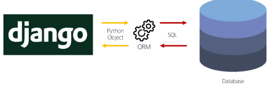
### QuerySet API
- ORM에서 데이터를 검색, 필터링, 정렬 및 그룹화 하는 데 사용하는 도구
- API를 사용하여 SQL이 아닌 Python 코드로 데이터를 처리
#### 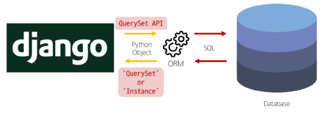
- QuerySet API 동작 예시
#### 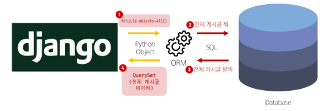
### Field lookups
- Query에서 조건을 구성하는 방법
- QuerySet 메서드 filter(), exclude() 및 get()에 대한 키워드 인자로 지정됨
```python
# 내용에 'dja'가 포함된 모든 게시글 조회
Article.objects.filter(content__contains='dja')

# 제목이 'he'로 시작하는 모든 게시글 조회
Article.objects.filter(title__startswith='he')
```
### Q 객체
- Q()
- Django ORM에서 복잡한 조건을 구성할 때 사용하는 도구
### Q 객체를 통한 ORM 조건 구성
- Q 객체 생성
```python
from django.db.models import Q

Q(content__contains='dja')

Q(title__startswith='he')
```
- 비트 논리 연산자를 활용한 조건문 작성
  - AND(&)
  - OR(|)
  - NOT(~)
### AND 조건
- filter() 메서드 내 두 Q 객체를 &로 연결
```python
def and_query(request):
    articles = Article.objects.filter(
        Q(content__contains='dja') & Q(title__startswith='he')
    )
    serializer = ArticleSerializer(articles, many=True)
    return Response(serializer.data)
```
### OR 조건
- filter() 메서드 내 두 Q 객체를 |로 연결
```python
def or_query(request):
    articles = Article.objects.filter(
        Q(content__contains='dja') | Q(title__startswith='he')
    )
    serializer = ArticleSerializer(articles, many=True)
    return Response(serializer.data)
```
### NOT 조건
- filter() 메서드 내 Q 객체 앞에 ~
```python
def not_query(request):
    articles = Article.objects.filter(
        ~Q(title__startswith='he')
    )
    serializer = ArticleSerializer(articles, many=True)
    return Response(serializer.data)
```