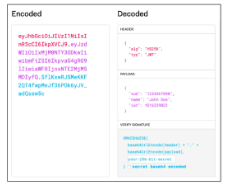
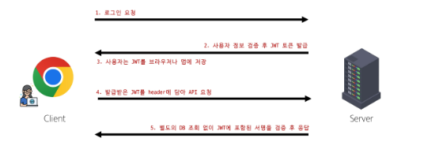

# PJT 11
# JWT(JSON Web Token)
## JWT 개요
- 유저가 스스로 누군지 증명하는 디지털 출입증
- 서버가 유저에게 발급해주는 긴 문자열
- 해당 문자열 안에는 유저의 정보가 암호화되어 들어있음
### JWT 구조
- JWT는 .(dot)으로 구분하고, 3부분으로 나뉘어져 있음
  1. Header
      - 어떤 알고리즘으로 암호화 했는지 적혀있는 봉투 역할
  2. Payload
      - 실제 유저 정보가 들어있는 내용물
      - 누구나 열어볼 수 있어 민감한 정보가 있어서는 안됨
  3. Signature
      - 정보가 조작되지 않았음을 증명하는 위조 방지 도장
      - 서버가 가진 키로 위조 유무를 확인할 수 있음
#### 
### JWT 동작 흐름
#### 
### JWT 특징
- 장점
  - 서버 부담이 적음
    - DB에 저장하여 누가 로그인 중인지 기억할 필요없음(Stateless)
  - 확장성이 좋음
    - 서버를 여러 대 늘려도(Scale-out) 토큰만 있으면 어떤 서버에서든 인증이 가능
  - 모바일 친화적
    - 웹 뿐만 아니라 앱애서도 쓰기 편람
- 단점
  - 키를 잃어버렸을 경우 대응하기 어려움
  - 실수로 payload에 개인정보가 있을 시 누구든 확인할 수 있음
### Token 방식 vs. JWT 방식
- Token 방식
  - 키 자체에는 아무런 정보가 없고, 정보는 서버가 가지고 있음
  - DB에 저장된 정보를 확인하여 사용자 인증을 하게 됨
  - 번거롭지만 키 유출시 서버에서 Disable 처리하여 대응 가능
  - 로그인 관리가 엄격해야 하는 경우 사용(은행)
- JWT 방식
  - 키에 정보가 들어있어 서버가 정보를 따로 확인할 필요가 없음
  - 서버가 토큰을 해석해서 사용자 인증을 하게 됨
  - 간단하지만 키 유출 시 대응하기 힘듦
  - 대규모 트래픽 처리가 필요한 곳에서 사용(SNS, 쇼핑몰)
## JWT 실습
- djangorestframework-simplejwt 사용
  - DRF 공식 문서 확인
  - dj-rest-auth 공식 문서 확인
### simple-jwt 설정
1. simple-jet 패키지 설치
```cmd
$ pip install djangorestframework-simplejwt
```
2. settings.py 설정
    - 기존 TokenAuthentication을 주석처리 후 JWTAuthentication으로 변경
```python
REST_FRAMEWORK = {
    # Authentication
    'DEFAULT_AUTHENTICATION_CLASSES': [
        # 'rest_framework.authentication.TokenAuthentication',
        'rest_framework_simplejwt.authentication.JWTAuthentication',
    ],
    # permission
    'DEFAULT_PERMISSION_CLASSES': [
        'rest_framework.permissions.AllowAny',
    ],
}
```
3. setting.py 설정
    - INSTALLED_APP에 restframework-simplejwt 등록
    - dj-rest-auth의 login url을 그대로 활용하기 위해 USE_JWT를 True로 설정
```python
INSTALLED_APPS = [
    ...
    'rest_framework_simplejwt',
    ...
]

REST_AUTH = {
    'REGISTER_SERIALIZER': 'accounts.serializers.CustomRegisterSerializer',
    'USE_JWT': True,
}
```
### Vue에서 LogIn 설정 변경
1. stores/accounts.js에서 logIn 함수 수정
  - Login 완료 후 console 창에서 응답 확인
```javascript
const user = ref(null)

const logIn = function ({ username, password }) {
  axios({
    method: 'post',
    url: `${API_URL}/accounts/login/`,
    data: {
      username, password
    },
  })
    .then(res => {
      console.log('로그인이 완료되었습니다.')
      console.log(res.data)
      token.value = res.data.access   // token 저장
      user.value = res.data.user      // 같이 전달되는 로그인 user 정보 저장
      router.push({ name: 'ArticleView' }) 
    })
    .catch(err => console.log(err))
}

const isLogin = computed(() => {
  return token.value ? true : false
})
```
### JWT 정보 확인해보기
1. 전달된 access token을 복사하여 jwt.io에서 내부 확인
2. settings.py 상단에 있는 SECRET_KEY를 붙여 넣으면 인증됨을 확인할 수 있음
### 게시글 조회, 생성 axios 수정
- Authorization 설정에서 Token이 아닌 Bearer로 변경
  - stores/articles.js 수정 후 정상 동작 확인
  - views/CreateView.vue 수정 후 정상 동작 확인
```javascript
const getArticles = function () {
  axios({
    method: 'get',
    url: `${API_URL}/api/v1/articles/`,
    headers: {
      // 'Authorization': `Token ${accountStore.token}`
      'Authorization': `Bearer ${accountStore.token}`
    },
  })
  ...
}
```
```javascript
const createArticle = function () {
  axios({
    method: 'post',
    url: `${store.API_URL}/api/v1/articles/`,
    data: {
      title: title.value,
      content: content.value
    },
    headers: {
      // 'Authorization': `Token ${accountStore.token}`
      'Authorization': `Bearer ${accountStore.token}`
    },
  })        
  ...
}
```
## refresh token
- 로그인을 다시 하지 않아도 Access Token을 새로 받을 수 있게 하는 장기 열쇠 같은 것
### refresh token의 필요성
- Access Token은 짧게 쓰는 출입증 역할을 함
  - 유출되었을 때 대응하기 힘들기 때문에 유효시간을 짧게 설정
  - 유효기간이 짧으면 금방 만료되고 로그인이 필요해 짐
  - 잦은 로그인은 매우 불편함
- refresh token은 이런 access token을 재발급 받을 수 있게 하는 용도로 쓰임
  - 유효시간은 access token 보다 길제 설정
  - 외부에 노출되지 않게 잘 보관해야 함
### access token 재발급 흐름
1. 기본 access token을 활용해서 서버에 요청
2. 여기서 access token 이 만료되면 401 에러가 발생
3. 이 때 refresh token을 활용해 access token을 재발급 받음
    - 재발급에 성공한 경우
      - 발급받은 access token으로 다시 서버에 요청
    - 재발급에 실패한 경우
      - refresh token이 만료되어 다시 로그인 해야 함
## refresh token 실습
### refresh token 발급 받기
- 로그인 시 발급받은 refresh token 저장(return도 같이 등록)
```javascript
// stores/accounts/js

export const useAccountStore = defineStore('account', () => {
  const API_URL = import.meta.env.VITE_API_URL
  const token = ref(null)
  const refresh = ref(null)
  ...

  const logIn = function ({ username, password }) {
    axios({
      method: 'post',
      url: `${API_URL}/accounts/login/`,
      data: {
        username, password
      },
    })
      .then(res => {
        console.log('로그인이 완료되었습니다.')
        console.log(res.data)
        // token.value = res.data.key
        token.value = res.data.access   // token 저장
        user.value = res.data.user      // 같이 전달되는 로그인 user 정보 저장
        refresh.value = res.data.refresh
        router.push({ name: 'ArticleView' }) 
      })
      .catch(err => console.log(err))
  }
  ...
  return {
    signUp,
    logIn,
    token,
    isLogin,
    logOut,
    user,
    refresh,
    // refreshAccessToken,
  }
}, { persist: true })
```
- settings.py 수정
```python
REST_AUTH = {
    'REGISTER_SERIALIZER': 'accounts.serializers.CustomRegisterSerializer',
    'USE_JWT': True,
    'JWT_AUTH_HTTPONLY': False,     # refresh token을 받기 위한 준비 (기본이 True)
}
```
### token 만료 기한 설정
- 현재 access token은 5분, refresh token은 1일로 만료 기한이 설정되어 있음
- access token의 경우 적정 만료 기한
  - 짧을 수록 보안에 유리
  - 다만 너무 짧으면 갱신 요청이 많아지게 됨
  - 대부분의 서비스는 10 ~ 15분으로 설정
    - 보안에 민감한 경우 5 ~ 10분으로 설정(금융권)
- refresh token의 경우 적정 만료 기한
  - 일반적으로 1 ~ 2주 또는 30일을 주로 사용
  - 보안이 안전한 곳에서는 30 ~ 90일까지도 사용
    - 보안에 민감한 경우 1 ~ 14일로 설정
- 실습 테스트를 위해 임시로 access token(1분) / refresh token(2분)으로 설정
  - 실제 프로젝트에서는 권장 시간으로 설정 필요
```python
# my_api/settings.py

from datetime import timedelta
SIMPLE_JWT = {
    # 테스트를 위해 임시로 access: 1분/ refresh: 2분 설정
    'ACCESS_TOKEN_LIFETIME': timedelta(minutes=1),
    'REFRESH_TOKEN_LIFETIME': timedelta(minutes=2),
}
```
### refresh token을 활용한 access token 갱신
- stores/accounts.js에서 refreshAccessToken 함수 정의
```javascript
export const useAccountStore = defineStore('account', () => {
  ...
  const refreshAccessToken = function () {
    return axios({
      method: 'post',
      url: `${API_URL}/accounts/token/refresh/`,
      data: {
        refresh: refresh.value,
      }
    })
      .then(res => {
        token.value = res.data.access
        return true
      })
      .catch(err => {
        console.log(err)
        return false
      })
  }

  return {
    ...
    refreshAccessToken,
  }
}, { persist: true })
```
### Article 목록 요청 시 access token 재발급
- 요청에 실패한 경우 catch 메서드 실행됨
- 요청 실패의 원인이 401(Unauthorized)인 경우
  - refreshAccessToken 함수를 실행하여 access token을 재발급
    - access token 재발급 성공시
      - Article 목록에서 다시 요청하여 목록을 받아 옴
    - access token 재발급 실패시
      - refresh token이 만료됨을 의미
      - 모든 인증 정보를 삭제한 후 로그인 페이지 이동
- stores/articles.js에서 getArticle 메서드 수정
```javascript
// store/articles.js

export const useArticleStore = defineStore('article', () => {
  const accountStore = useAccountStore()

  const API_URL = import.meta.env.VITE_API_URL
  const articles = ref([])

  const getArticles = function () {
    ...
      .catch(err =>{
        console.log(err)

        if (err.response?.status === 401) {
          console.log('Access Token 재발급 진행!')
          
          // access token 재발급은 비동기 요청
          accountStore.refreshAccessToken()
            .then(ok => {
              // 재발급에 실패한 경우 종료
              if (!ok) {
                window.alert('다시 로그인이 필요합니다.')
                accountStore.logOut()   // 기존에 저장된 token을 제거하기 위함
                router.push({ name: 'LogInView' })
                return 
              }
              // 재발급에 성공한 경우 재요청 진행
              axios({
                method: 'get',
                url: `${API_URL}/api/v1/articles/`,
                headers: {
                  'Authorization': `Bearer ${accountStore.token}`
                },
              })
                .then(res => {
                  articles.value = res.data
                })
              })
          }
      })
  }

  return { API_URL, articles, getArticles, }
}, { persist: true })
```
### Article 생성 요청 시 access token 재발급
```javascript
// views/CreateView.vue

const createArticle = function () {
  ...
    .catch(err =>{
      console.log(err)

      if (err.response?.status === 401) {
        console.log('Access Token 재발급 진행!')
        
        // access token 재발급은 비동기 요청
        accountStore.refreshAccessToken()
          .then(ok => {
            // 재발급에 실패한 경우 종료
            if (!ok) {
              window.alert('다시 로그인이 필요합니다.')
              accountStore.logOut()   // 기존에 저장된 token을 제거하기 위함
              router.push({ name: 'LogInView' })
              return 
            }
            // 재발급에 성공한 경우 재요청 진행
            axios({
              method: 'post',
              url: `${API_URL}/api/v1/articles/`,
              headers: {
                'Authorization': `Bearer ${accountStore.token}`
              },
              data: {
                title: title.value,
                content: content.value
              },
            })
              .then(res => {
                router.push({ name: 'ArticleView' })
              })
            })
        }
    })
}
```
# 위치 기반 지도 검색 기능 구현
## Geolocation API
- 사용자의 현재 위치 정보를 브라우저를 통해 간편하게 얻을 수 있는 인터페이스
- 지도, 내비게이션, 위치 기반 서비스 등 구현
```python
navigator.geolocation.getCurrentPosition(
    SuccessCallBack,
    ErrorCallBack,
    Options ...
)
```
- navigator: 사용자 에이전트의 상태와 신원 정보
- geolocation: 장치의 위치 정보에 접근할 수 있는 객체
- getCurrentPosition: 사용자의 현태 위치를 불러오는 메서드
- SuccessCallBack
```javascript
function (pos) {
  console.lof(pos)    // GeolocationPosition
  //        위도        경도
  const { latitude, longitude } = pos.coords
}
```
### 현재 위치 위도, 경도 코드
- 최소 실행 시 사이트에 있는 동안 허용(권장)
- 실행 위치에 따라 결과값은 다름
```javascript
const getCurrentPosition = () => {
  navigator.geolocation.getCurrentPosition(
    (pos) => {
      const { latitude, longitude }
      console.log(`위도: ${latitude}, 경도: ${longitude}`)
    },
  )
}
```
### Vue 코드
- 위도, 경도, 에러를 저장할 변수 선언
- 함수 실행 시 사용자의 현재 위치를 불러올 loadLocation 함수 정의
- 필요하다면, onMounted 활용
```javascript
import { ref } from 'vue'

const lat = ref(null)
const lng = ref(null)
const error = ref('')

const loadLocation = () => {
  navigator.geolocation.getCurrentPosition(
    (pos) => {
      lat.value = pos.coords.latitude
      lng.value = pos.coords.longitude
    },
    (err) => { 
      error.value = `위치 조회 실패: ${err.message}` 
    },
  )
}
```
- 버튼 클릭 시, 함수 실행 -> 접근 권한 허용
- 얻어온 위도, 경도 정보 화면에 렌더링
```javascript
<template>
  <div>
    <button @click="loadLocation">내 위치 가져오기</button>
    <p v-if="lat && lng">Lat: {{ lat }}, Lng: {{ lng }}</p>
    <p v-if="error">{{ error }}</p>
  </div>
</template>
```
## iframe
- Inline Frame의 줄임말
- HTML 문서 안에 또 다른 HTML 문서를 삽입하는 태그
- 외부 페이지를 현재 페이지에 embedded할 때 사용
### iframe 기본 문법
- src
  - 삽입할 문서의 URL
- width, height
  - iframe의 크기
- allowfullscreen
  - 전체화면 전환 허용 여부
- loading
  - lazy 설정 시 화면에 보여야 할 때 최초 로딩
### iframe 활용 예시
- YouTube 영상
  - https://www.youtube.com/embed/\<video_id>
- Google Maps
  - https://www.google.com/maps?ouput=embed&q=\<keyword>
```javascript
<iframe
  src="https://www.google.com/maps?ouput=embed"
  width="600"
  height="400"
  allowfullscreeen
  loading="lazy"
></iframe>
```
- Google Calendar
  - https://calendar.google.com/calendar/embed?src=\<ics>
- 위도, 경도 정보를 토대로 mapUrl 작성
- 실행 위치에 따라 결과값은 다름
```vue
<template>

  <iframe :src="mapUrl"></iframe>
</template>

<script setup>
// iframe 지도 업데이트
const updateMap = () => {
  mapUrl.value =
    `https://maps.google.com/maps` +
    `?ll=${lat.value},${lng.value}` +
    `&z=14` +
    `&output=embed` +
    `&q=${keyword.value.trim()}`
}
</script>
```
- 사용자 입력값을 query로 활용
```vue
<template>
  <input v-model="keyword" @input="updateMap"/> <br>
</template>

<script setup>
const keyword = ref('')

// iframe 지도 업데이트
const updateMap = () => {
  mapUrl.value =
    `https://maps.google.com/maps` +
    `?ll=${lat.value},${lng.value}` +
    `&z=14` +
    `&output=embed` +
    `&q=${keyword.value.trim()}`
}
</script>
```
### 생각 포인트
- 현재 구현된 기능 상, 사용자가 값을 입력할 때마다 지도가 업데이트 됨
- 별도의 API key 없이 구현된 상태에서는 큰 문제는 없음
  - 빈번한 reloading으로 인한 UX 갑소는 있으나 큰 이슈라고 보기는 힘듦
- 그러나 API를 연동하여 사용해야 한다면?(예: 유튜브 API)
  - 매 입력마다 유료 API에 요청 -> 과금 발생
- 입력값을 감시하고, 특정 조건을 만족할 때마다 갱신하면 어떨까?
  - Watch의 경우, 변경되었다는 사실만을 알 수 있음
## diff 패키지
### jsdiff
- JavaScript로 텍스트 구분을 구현한 것 이전 텍스트와 새 텍스트를 받아서 두 텍스트의 차이를 구분
### 패키지 설치
- NPM을 통해 쉽게 설치 가능
- 제공된 skeleton 코드에는 이미 설치되어 있음
- package.json에 작성된 의존성 패키지 목록을 기반으로 최초 npm install 과정에서 설치 완료
### diff 메서드 종류
- diff.diffChars(oldStr, newStr[, options])
  - 두 텍스트를 비교하여 각 문자를 토큰으로 취급
- diff.diffWords(oldStr, newStr[, options])
  - 두 텍스트를 비교하여 각 단어와 각 구두점을 토큰으로 처리
- diff.diffWordsWithSpace(oldStr, newStr[, options])
  - 두 텍스트를 비교하여 각 단어, 구두점, 줄 바꿈 또는 공백을 토큰으로 처리
### diffChars 코드 예시
- diffChars를 diff에서 import
- 두 문자열을 비교한 결과 객체 목록을 반환
- 변환 구조
```text
{ "count": 3, "added": false, "removed": false, "value": "변경 " }
{ "count": 1, "added": false, "removed": true, "value": "전" }
{ "count": 4, "added": true, "removed": false, "value": "후 추가" } 
```
```vue
<script setup>
import { diffChars } from 'diff'

const oldStr = '변경 전'
const newStr = '변경 후 추가' 
const changes = diffChars(oldStr, newStr)

</script>
```
### diffChars 코드 활용 1
- 추가, 삭제 여부에 따라 added, removed 값에 변화
- added or removed에 따라 각기 다른 스타일을 부여
```vue
<span 
  v-for="(change, index) in changes" 
  :key="index"
  :class="{ add: change.added, removed: change.removed }"
>
  {{ change.value }}
</span>
```
### diffChars 코드 활용 2
- 변경 사항이 발생한 총 문자의 수를 count
```javascript
// diffChars 활용 2
const diffCount = changes
  // 추가 되었거나 제거된 문자열만 filter
  .filter(function (char) {
    return char.added || char.removed
  })
  // 총 변경 단어 수를 count
  .reduce(function(sum, char) {
    return sum + char.count
  }, 0)
```
### 위치 기반 지도 검색 기능 구현 완성 코드
```vue
<script setup>
// diff로 키워드 변화 판단 및 지도 갱신 시도
const tryUpdateMap = () => {
  const changes = diffChars(prevKeyword.value, keyword.value)
  const diffCount = changes
  // 추가 되었거나 제거된 문자열만 filter
  .filter(function (char) {
    return char.added || char.removed
  })
  // 총 변경 단어 수를 count
  .reduce(function(sum, char) {
    return sum + char.count
  }, 0)

  const threshold = 2 // 최소 두 글자 이상 바뀌어야 지도 업데이트
  if (diffCount >= threshold) {
    updateMap()
  } else {
    error.value = '키워드가 크게 바뀌지 않았습니다.'
  }
}

// iframe 지도 업데이트
const updateMap = () => {
  // 키워드가 비어있으면 현재 위치로 설정
  const query = keyword.value.trim() 
  ? keyword.value 
  :`${lat.value},${lng.value}`

  mapUrl.value =
    `https://maps.google.com/maps` +
    `?q=${query}` +
    `&ll=${lat.value},${lng.value}` +
    `&z=15` +
    `&output=embed`

  prevKeyword.value = keyword.value // 현재 키워드 저장
  error.value = ''
}
</script>
```