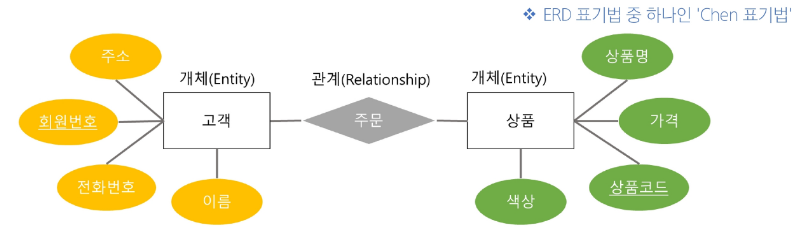
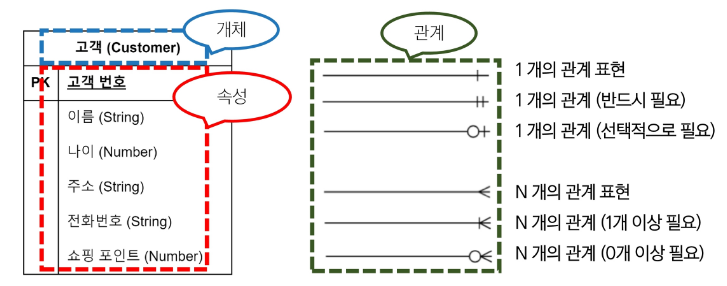
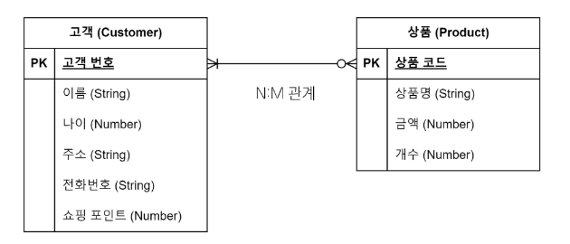
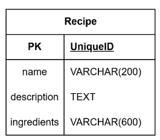

- 필수 기능은 지정주제하나 선택해서 필수 똑같이 구현
- 매주 데이터 셋 없는상황에서는 지정에서 하나 정해서 매주 제출은 하고 추가로 시간 써야함
- 무조건 '추천'이라는 대주제 내에서 구현
- 합성데이터는 제한적으로 사용
- 1학기 학습 프레임워크만 사용가능
- API, 라이브러리, 패키지 등은 자유롭게 활용 가능

# PJT 7 - 데이터베이스 모델링
# 데이터베이스 모델링
- 데이터베이스 시스템을 구축하기 위해, 데이터의 구조와 관계, 제약 조건 등을 설계하여 효율적이고 일관성있는 데이터베이스를 만들기 위한 과정
- 모델링을 통해 성능, 무결성, 신뢰성을 보장할 수 있음
- 데이터베이스 모델링의 중요성
  - 효율성
    - 데이터베이스 구조를 잘 설계하면 쿼리 성능과 저장 효율이 향상
  - 일관성
    - 중복과 이상 현상을 최소화하여, 데이터가 서로 모순되거나 충돌하지 않도록 함
  - 무결성 보장
    - 무결성 제약 조건을 모델링 단계에서 설정해두어, 부적절한 데이터를 방지
## 무결성 제약 조건
### 무결성
- 데이터베이스가 잘못된 데이텅의 삽입/수정/삭제로부터 보호되어, 데이터의 일관성과 신뢰성을 유지하는 것
### 무결성 제약 조건
1. 개체 무결성(Entity Integrity)
   - 기본키가 유일(중복 불가)하고, NULL 값을 허용하지 않는 제약
   - 핵심 원칙
      1. 각 레코드는 유일한 식별자를 가져야 함(PK 중복 불가)
      2. 기본키는 NULL 값을 가질 수 없음(필수값)
```sql
CREATE TABLE Student (
  student_id INT PRIMARY KEY,
  name VARCHAR(50) NOT NULL
);
```
2. 참조 무결성(Referential Integrity)
   - 외래키와 관련된 제약으로, 존재하지 않는 기본키를 참조하지 목하도록 하는 규칙
   - 핵심 원칙
      1. 외래키는 참조 대상 테이블의 기본키 값을 참조하거나 NULL 값을 가질 수 있음
      2. 참조 대상 테이블에 존재하지 않는 기본키 값은 사용할 수 없음
      3. 외래키로 연결된 레코드를 삭제/수정할 때, 연쇄 작업(ON DELETE CASCADE 등) 또는 예외 처리를 통해 무결성 유지
```sql
CREATE TABLE Student (
  student_id INT PRIMARY KEY,
  name VARCHAR(50) NOT NULL
);
CREATE TABLE Employee (
  emp_id INT PRIMARY KEY,
  emp_name VARCHAR(50) NOT NULL,
  dept_id INT,
  FOREIGN KEY (dept_id) REFERENCES Department(dept_id)
);
```
3. 도메인 무결성(Domain Integrity)
   - 각 속성이 정의된 도메인(값의 범위, 형식)을 벗어나지 않도록 하는 제약
   - 핵심 원칙
      1. 속성별로 데이터 타입, 길이, 범위 등을 정의해야 함
      2. 값이 해당 범위(도메인)를 벗어나면 삽입/수정이 제한되거나 오류 발생
```sql
CREATE TABLE Product (
  product_id INT PRIMARY KEY,
  price DECIMAL(10, 2) CHECK (price > 0), -- 가격은 0보다 커야 함
  category VARCHAR(20) CHECK (category IN ('전자제품', '의류', '도서')) -- 특정 값만 허용
);
```
4. 고유성(UNIQUE)
   - 특정 컬럼의 값이 테이블 내에서 중복되지 않도록 제한
   - 예: 이메일 주소는 한 사용자가 하나만 등록 가능
5. NULL 무결성(NOT NULL)
   - 특정 컬럼이 NULL 값을 가질 수 없도록 하는 제약
6. 일반 무결성(General Integrity)
   - 위의 특정 제약조건 외에도, 비즈니스 로직에 따라 추가로 정의하는 무결성 규칙
   - 예: 은행 잔고가 0 미만이 되지 않도록 하거나, 재고 수량이 음수가 되지 않도록 하는 규릭
## 모델링 과정 4단계
### 1. 요구사항 수집 및 분석
- 어떤 종류의 데이터를 정리하는지 정보 수집하고 어떤 작업을 수행해야 하는지 파악하는 단계
  - 개체(Entity): 업무에 필요하고 유용한 정보를 저장하는 집합적인 것
    - 예: 고객, 상품
  - 속성(Attribute): 관리하고자 하는 것의 의미를 더 이상 작은 단위로 분리되지 않은 데이터 단위
    - 예: 고객명, 고객 전화번호, 상품명, 상품 가격
  - 관계(Relationship): 객체 사이의 논리적인 연관성을 의미하는 것
    - 예: 고객은 다수의 상품을 주문, 상품은 다수의 고객들에게 판매될 수 있음
### 2. 개념적 설계
- 요구사항을 기반으로 데이터베이스의 개념적 모델을 설계
- 개체와 관계를 식별하고, 개체 간의 관계를 정의하여 ER Diagram을 작성
- ERD 표기 방법
#### <Chen 표기법>
#### 
#### <까마귀 발 모델 표기법>
#### 
#### <N:M 관계 예시>
#### 
### 3. 논리적 설계
- 개념적 설계 단계에서 정한 데이터의 구조를, 실제 데이터베이스가 이해할 수 있는 테이블 형태로 변환하는 과정
  - 예를 들어, 개념적 설계에서 도출된 N:M 관계는, 논리적 설계 단계에서 중개 테이블을 생성하여 두 개의 다대일 관계로 해소해야 함
  - 개념적 설계(N:M) 고객(N) <-> (M)상품
  - 논리적 설계(1:N, N:1) 고객(1) -> (N)주문(N) <- (1)상품
- 개념적 설계를 기반으로 데이터베이스의 논리적 구조를 설계
- 테이블, 컬럼, 제약 조건 등과 같은 구체적인 데이터베이스 개체를 정의
- 정규화를 수행하여 데이터의 중복을 최소화하고 일관성을 유지
### 4. 물리적 설계
- 논리적 설계를 기반으로 데이터베이스를 실제 저장 및 운영할 수 있는 형태로 변환하는 단계
- 테이블의 인덱스, 파티션, 클러스터링 등 물리적인 구조와 접근 방식을 결정
- 보안, 백업 및 복구, 성능 최적화 등을 고려하여 데이터베이스를 설정
# 데이터베이스 정규화
## 정규화(Normalization)
- 데이터 중복을 최소화하고, 이상 현상을 예방하며, 데이터베이스 구조 변경 시 재작업을 줄이는 목적으로 테이블을 구조화하는 과정
### 정규화 목적
1. 중복 최소화
   - 불필요한 중복 데이터를 제거해 일관성 유지
2. 이상 현상 방지
   - 삽입, 갱신, 삭제 작업 시 발생할 수 있는 불일치 문제 예방
3. 유연성 향상
   - 데이터베이스 구조 변경 시 영향을 받는 영역을 최소화하여 유지보수성을 높임
## 이상 현상(Anomaly)
- 데이터베이스를 비정상적으로 설계했을 때 중복된 데이터가 많아져 삽입, 삭제, 갱신 등의 연산에서 비일관성이 생기는 문제
### 이상 현상 종류
1. 삽입 이상(Insection Anomaly)
   - 새로운 데이터를 삽입하기 위해 불필요한 데이터도 함께 삽입해야 하는 문제
2. 갱신 이상(Update Anomaly)
   - 중복된 데이터 중 일부만 변경되어 데이터 불일치가 발생하는 문제
3. 삭제 이상(Deletion Anomaly)
   - 어떤 데이터를 삭제할 때, 반드시 있어야 하는 정보까지 같이 사라지는 문제
## 정규화 종류
- 일반적으로 1NF에서 시작해, 2NF, 2NF 순으로 진행하며, 필요에 따라 BCNF 이상(4NF, 5NF, 6NF)까지 고려하기도 함
- 실무에서는 보통 3NF 또는 BCNF까지 도달하면 정규화가 이루어졌다고 표현
- 지나친 분리로 인한 조인 증가나 성능 저하 등의 문제가 발생하기 때문에 업무 요구에 따라 필요한 만큼 정규화/반정규화를 조정할 것을 권장
## 1NF(제 1 정규형)
1. 각 속성이 원자값(Atomic Value)을 가져야 함
2. 중복된 컬럼이 없어야 함
3. 각 행이 유일하게 식별될 수 있어야 함(기본키 존재)
## 2NF(제 2 정규형)
1. 제 1 정규형을 만족해야 함
2. 복합키(두 개 이상의 컬럼으로 이루어진 기본키)를 사용하는 테이블에서 모든 비키본키 속성이 기본키의 모든 컬럼에 완전 종속되어야 함
   - 즉, 부분 함수 종속(기본키 일부 컬럼만으로 해당 속성이 결정되는 것)을 제거
#### ※ 함수 종속성(Functional Dependency)
- 테이블 내의 속성들 간의 관계를 설명하는 규칙
- 만약 속성 A의 값을 알면 속성 B의 값을 유일하게 결정할 수 있을 때, B는 A에 함수적으로 종속된다고 하며, A -> B로 표기
- 예시
  - 학생 테이블에서 학번을 알면 이름을 유일하게 알 수 있음(학번 -> 이름)
  - 여기서 학번처럼 다른 속성을 결정하는 속성을 결정자(Determinant)라고 함
- 결정자란?
  - 관계형 테이블에서 함수적 종속성 X -> Y가 성립할 때, 좌변 X를 결정자라고 부름
  - 즉, X의 값이 같으면 Y의 값도 반드시 같다는 규칙에서 다른 값을 결정해 주는 속성 집합
## 3NF(제 3 정규형)
1. 제 2 정규형을 만족해야 함
2. 기본키에 대한 이행적 함수 종속(Transitive Dependency)이 없어야 함
   - A -> B, B -> C인 경우, A -> C를 이행 종속이라 부름
   - 기본키가 아닌 속성이 다른 속성에 의해 결정되지 않아야 함
   - 예: 학생 테이블에서 학과 번호 -> 학과 명 -> 대학 이름 식으로 이어진다면, 학과 번호 -> 대학이름 부분을 별도 테이블로 분리
## BCNF(Boyce Codd Normal Form)
1. 제 3 정규형을 만족해야 함
2. 모든 결정자가 후보키여야 함(BCNF의 핵심 정의)
3. 3NF 이후에도 남아있는 이상 현상을 해결하는 더 엄격한 형태
4. 기본키가 아닌 속성이 다른 컬럼을 결정할 수 없게끔 테이블을 분해
#### ※ 후보키(Candidate Key)
- 모든 속성을 결정하는 최소 결정자
- 한 테이블의 각 행을 유일하게 식별할 수 있는 속성(또는 속성 조함) 중 최소성을 만족하는 키
- 후보키의 조건
  1. 유일성(Unique): 테이블의 각 행을 고유하게 식별할 수 있어야 함
  2. 최소성(Minimality)
    - 불필요한 컬럼을 포함하지 않는, 최소한의 속성 조합이어야 함
    - 예: 복합키가 후보키 일 때, 단 하나의 컬럼이라도 빼면 유일성이 깨져야 함
- 한 테이블에 여러 후보키가 있을 수 있으며, 그중 하나를 기본키로 선택해야 함
### BCNF 분해 원칙
- BCNF 규칙을 위반한 종속성 X -> Y를 기준으로 분해
- 위반된 종속성인 담당 교수 -> 과목명을 기준으로 테이블을 분리
- 무손실 분해(원본이 가진 모든 정보/종속성을 잃어버리지 않음)
# 데이터베이스 모델링 실습
## 레시피 관리 프로젝트
### Recipe model
- 요리 레시피와 재료를 관리하는 웹 애플리케이션
- 하나의 레시피에 여러 재료가 들어갈 수 있음
  - 레시피 데이터 생성 시, 재료를 다중 선택 할 수 있어야 함
  - ingredients 컬럼에 콤마로 구분된 문자열을 저장(MultipleChoiceField)
- class 정의
```python
# foods/models.py

class Recipe(models.Model):
    name = models.CharField(max_length=200)
    description = models.TextField(blank=True)
    # 재료들 정보를 쉼표로 구분하여 저장
    ingredients = models.CharField(
        max_length=600,
        blank=True,
    )
    def __str__(self):
        return self.name
```
- RecipeForm ModelForm class 정의
```python
# foods/forms.py

class RecipeForm(forms.ModelForm):
    # 식재료 정보 입력 필드
    ingredients = forms.MultipleChoiceField(
        choices=[
            ('TMT', '토마토'),
            ('OLV', '올리브'),
            ('PAS', '파스타'),
        ],
        widget=forms.CheckboxSelectMultiple,
        help_text='요리 재료를 선택하세요.',
    )

    class Meta:
        model = Recipe
        fields = '__all__'
```
### 정규화 및 모델 정의
- 제 1 정규화
  - 각 속성이 원자값이어야 함 -> 식재료 저장하는 테이블을 분리
  - 레시피 테이블과 식재료 테이블의 관계를 위한 중개 모델 정의
#### 
## 사전 준비 및 프로젝트 코드 확인
- 다대다 관계를 위한 ManyToManyField를 사용
```python
# foods/models.py

# 식재료 모델
class Ingredient(models.Model):
    name = models.CharField(max_length=100)

    def __str__(self):
        return self.name

class Recipe(models.Model):
    name = models.CharField(max_length=200)
    description = models.TextField()
    ingredients = models.ManyToManyField(
        Ingredient,
        related_name='recipes',
    )
    # Ingredient 클래스가 Recipe 클래스 이후에 정의 되었을 경우 다음과 같이 표기 가능
    # ingredients = models.ManyToManyField(
    #     'foods.Ingredient',
    #     related_name='recipes',
    # )

    def __str__(self):
        return self.name
```
- 정의한 model을 DB에 반영
```cmd
$ python manage.py makemigrations
$ python manage.py migrate
$ python manage.py createsuperuser
```
- Admin 페이지에 등록 후, 계정 생성 및 식재료 정보 생성
```python
# foods/admin.py

from django.contrib import admin
from .models import Recipe, Ingredient

# Register your models here.

admin.site.register(Recipe)
admin.site.register(Ingredient)
```
- ingredients 필드를 위한 ModelMultipleChoiceField로 변경
```python
# foods/forms.py

class RecipeForm(forms.ModelForm):
    # 사용자로부터 다중 데이터를 선택받아야 할때
    ingredients = forms.ModelMultipleChoiceField(
        queryset=Ingredient.objects.all(),
        widget=forms.CheckboxSelectMultiple,
        required=False,
    )

    class Meta:
        model = Recipe
        fields = [
            'name',
            'description',
            'ingredients',
        ]
```
#### ※ queryset 속성
- queryset에는 어떤 모델의 레코드를 선택지로 쓸 것인지 지정
  - 선택지에 사용할(실제 필드에 저장될 값)을 해당 모델에서 직접 관리
    - 고유값 설정 혹은 __str__ 등
    - 선택지 정보의 변동 사항을 form에서 직접 수정하지 않아도 됨
- 필요에 따라 대상 모델이 가진 레코드 중, 일부만 필터링하여 사용 가능
- 필요에 따라 별도의 메서드를 정의하여 사용할 수도 있음
```python
from django.db.models import Q
from django import forms
from .models import Recipe, Ingredient

def get_filtered_ingredients():
    # '매운'을 포함하지 않는 재료 중 이름이 'A'로 시작하거나 'B'로 끝나는 재료만 선택
    return Ingredient.objects.exclude(name__contains='매운').filter(
        Q(name__startswith='A') | Q(name__endswith='B')
    )

class RecipeForm(forms.ModelForm):
    ingredients = forms.ModelMultipleChoiceField(
        queryset=,
        widget=forms.CheckboxSelectMultiple,
        required=False,
    )
```
## 레시피 생성
### 레시피 생성 view와 template
- 기존의 게시글 작성 방식과 완전히 동일
- 식재료 정보는 관리자 페이지에서 생성 완료 하였음
- 레시피 정보 생성시 선택한 데이터는 ModelMultipleChoiceField에 의해 중개 모델에 저장됨
- 즉, 저장 과정을 위해 별도의 전처리 과정 불필요
  - 예: 쉼표로 구분하여 저장하는 등의 save 과정 수정 필요 없음
- Widget을 사용하여 다중 선택이 가능한 checkbox 형태로 렌더링
## 레시피 조회
- Django M:N 관계의 역참조 매니저를 활용하여 렌더링
```html
<!-- foods/index.html -->




  <h1>INDEX PAGE</h1>
  
    <h2>{{ recipe.name }}</h2>
    <p>{{ recipe.description }}</p>
    <p>{{ recipe.ingredients }}</p>  
    <ul>
      
        <li>{{ ingredient.name }}</li>
      
    </ul>
    <hr>
  

```
#### ※ 주의사항: Model 정의시 MTM 주체
- 데이터 저장시, 식재료 정보와의 관계를 저장하기 위한 별도의 전처리 과정이 필요 없었던 이유는 Recipe 모델이 주체였기 때문
- Recipe 모델이 ingredient 모델과 ManyToManyField를 통해 관계를 직접 가지고 있음
- ModelForm이 Recipe.ingredients를 자동 인식
- form.save() 호출시 ModelForm이 이 관계를 자동 처리 가능
- 반대의 경우, Recipe는 ingredients를 직접 필드로 가지지 않음
- 따라서 ModelForm에서는 이 필드를 감지하지 못하고, form.save()시 관련 ManyToMany 관계는 무시됨
- 아래와 같은 추가적인 전처리 과정을 필요로 함
```python
# foods/views.py

recipe_form = RecipeForm(request.POST)
    if recipe_form.is_valid():
        recipe = recipe_form.save()
        ingredients = form.cleaned_data.get('ingredients')
        for ingredient in ingredients:
            ingredient.recipes.add(recipe)
```