# 문서 유사도
- 여러개의 문서(또는 문장) 중에서 얼마나 비슷한 내용을 담고 있는지를 수치로 표현한 것
- 추천 시스템
  - 도서, 영화, 금융 상품 등에서 사용자의 관심사와 유사한 콘텐츠를 찾아 추천
- 검색 및 정보 탐색
  - 입력 쿼리와 유사한 문서를 빠르게 찾고, 검색 결과 품질을 높임
- 분규/군집 및 중복 검출
  - 뉴스 기사/논문 등이 서로 얼마나 유사한지 계산
  - 중복 기사 묶음 처리, 토픽별 문서 분류
- 의사결정 지원
  - 방대한 문서(보고서, 계약서 등) 중 유사 문서나 핵심 정보를 신속히 파악 가능
# 문서 유사도 계산 방법
- 코사인 유사도
  - 두 벡터가 이루는 각도의 코사인 값을 이용
  - -1 이상 1 이하의 값을 가지며 값이 1에 가까울수록 유사도가 높다고 판단
- 자카드 유사도
  - 두 집합의 교집합 크기를 합집합 크기로 나눈 값
  - 텍스트 유사도 측정 시 단어 존재 여부만 고려
- 유클리드 거리
  - 공간적 거리 측정 방식으로, n차원 공간에서 두 점 사이의 직선 거리를 계산
  - 거리가 0에 가까울수록 유사도가 높다고 판단
## 코사인
- 빗변에 대한 인접변의 비
```math
\cos\theta 
= \frac{\text{인접변의 길이}}{\text{빗변의 길이}}
= \frac{\text{x축 좌표 값}}{\text{반지름 r}}
= \frac{\text{x 좌표}}{1}
= x 좌표
```
- 따라서 , x 축의 길이 = cos θ
#### 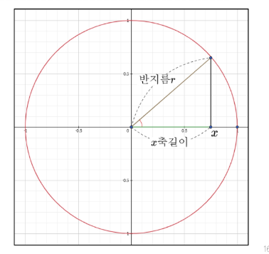
## 벡터
- 여러 수치를 일렬로 나열
- 방향과 크기를 나타내는 수학적 표현
- 원점 (0, 0)에서 좌표 (3, 4)에 대한 벡터 표현
#### 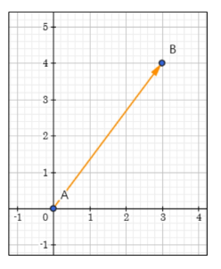
#### 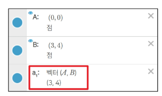
## 코사인 유사도
- 두 벡터가 이루는 각도의 코사인 값을 이용
- -1 이상 1 이하의 값을 가지며 값이 1에 가까울수록 유사도가 높다고 판단
```math
\text{cosine similarity} = \frac{A \cdot B}{\|A\| \, \|B\|}
```
- 두 벡터의 내적 계산
  - 벡터 A와 벡터 B의 내적은 동일 차원끼리 곱한 후, 모두 더한 값
```math
A \cdot B = (A_x \times B_x) + (A_y \times B_y)
          = (3 \times 4) + (3 \times 1)
          = 15
```
#### 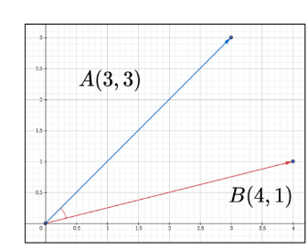
- 두 벡터의 크기(norm) 계산
  - 벡터의 크기는 피타고라스 정리를 이용
  - 각 좌표의 제곱의 합에 루트를 씌운 것
```math
\|A\|\,\|B\| 
= \sqrt{A_x^2 + A_y^2} \times \sqrt{B_x^2 + B_y^2}
= \sqrt{18} \times \sqrt{17}
= 3\sqrt{34}
= 17.492\ldots
```
- 코사인 유사도
```math
\frac{A \cdot B}{\|A\|\,\|B\|}
= \frac{15}{3\sqrt{34}}
= 0.857\ldots
```
#### 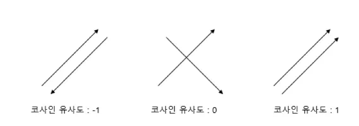
### 코사인 유사도 코드
```python
from numpy import dot           # 벡터 내적
from numpy.linalg import norm   # 벡터 크기

def consine_similarity(A, B):
  return dot(A, B) / (norm(A) * norm(B))
```
- 두 벡터의 관계를 코사인 값으로 나타내는 것이 목표
- 벡터를 활용하므로, 2차원 데이터가 아닌 경우에도 연산에는 문제없음
  - n차원으로 표기되는 데이터의 경우에도 직관적으로 시각화는 어려우나 수학적으로 정의는 가능
  - 예시와 같은 경우에도, 코사인 유사도 식 연산 가능
```math
\text{vector } A = (x_1, x_2, \ldots, x_n) \\
\text{vector } B = (y_1, y_2, \ldots, y_m)

```
# 카운트 기반 문서 유사도
- 코사인 유사도 방식으로 두 벡터간의 유사도를 알아내려면 벡터 값이 필요
- 주어진 데이터는 텍스트 형태의 데이터
- 텍스트 기반 데이터를 벡터 데이터로 변환할 수 있는 방법이 필요
## Bag of Words(BOW)
- 고유 단어 추출
  - 불용어(조사, 접속사 등)를 제거 -> 더 높은 정확도
- 각 단어에 인덱스 부여
  - 사전순 혹은 등장 순서대로 인덱스를 부여
- 문서 별 각 단어의 등장 빈도수 기록
  - 문서 내 등장 횟수를 해당 단어의 인덱스 위치에 기록
- 문서 별 빈도 벡터 정보
  - 단, 아래 예시는 편의상 불용어 제거 과정을 거치지 않음
#### 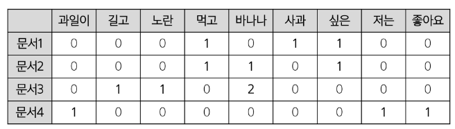
### Bag of Words 구현
- 문서 정의
- 단어 카운트 행렬 생성
```python
from sklearn.feature_extraction.text import CountVectorizer

# 문서 정의
docs = [
    "먹고 싶은 사과",
    "먹고 싶은 바나나",
    "길고 노란 바나나 바나나",
    "저는 과일이 좋아요"
]

# CountVectorizer로 단어 카운트 행렬 생성
vectorizer = CountVectorizer()
X = vectorizer.fit_transform(docs)
```
- numpy 배열로 변환
```python
import numpy as np

# numpy 배열로 변환
doc_term_matrix = X.toarray()

# 단어 목록 확인
vocab = vectorizer.get_feature_names_out()

# 결과 출력
print("단어 목록:", vocab)
print("\n문서-단어 행렬:\n", doc_term_matrix)
```
```text
단어 목록: ['과일이' '길고' '노란' '먹고' '바나나' '사과' '싶은' '저는' '좋아요']

문서-단어 행렬:
 [[0 0 0 1 0 1 1 0 0]
 [0 0 0 1 1 0 1 0 0]
 [0 1 1 0 2 0 0 0 0]
 [1 0 0 0 0 0 0 1 1]]
```
- 문서간 코사인 유사도 계산
```python
from numpy import dot                             # 문서 목록
from numpy.linalg import norm                     # docs = [
                                                  #   "먹고 싶은 사과",
def cosine_similarity(A, B):                      #   "먹고 싶은 바나나",
  return dot(A, B)/(norm(A)*norm(B))              #   "길고 노란 바나나 바나나",
                                                  #   "저는 과일이 좋아요"
for i in range(len(doc_term_matrix)):             # ]
  for j in range(i+1, len(doc_term_matrix)):
    print(f'문서{i+1}과 문서{j+1}의 유사도:')
    print(cosine_similarity(doc_term_matrix[i], doc_term_matrix[j]))
    print('-'*30)
```
```text
문서1과 문서2의 유사도:
0.6666666666666667
------------------------------
문서1과 문서3의 유사도:
0.0
------------------------------
문서1과 문서4의 유사도:
0.0
------------------------------
문서2과 문서3의 유사도:
0.47140452079103173
------------------------------
문서2과 문서4의 유사도:
0.0
------------------------------
문서3과 문서4의 유사도:
0.0
------------------------------
```
### 카운트 기반 문서 유사도 한계점
- 문서(단어) 벡터 간 유의미한 유사도를 계산할 수 없음
- 사과와 바나나는 과일이라는 공통점을 가지고 있으나, 해당 정보를 단어 카운트 행렬에서는 반영할 수 있는 방법이 없음
- 그 결과 1번 문서와 3번 문서의 유사도가 0으로 나오게 됨
# 임베딩 기반 문서 유사도
## 임베딩
## 워드 임베딩
- 텍스트를 의미를 반영한 숫자 벡터로 변환하는 기법
- 단순히 단어 등장 횟수를 세는 방식으로는 사과와 배가 과일이라는 의미적 유사도를 충분히 반영하기 어려움
- 임베딩 과정을 통해, 서로 의미가 비슷한 단어/문장이 고차원 벡터 공간 상에서 가까이 위치하도록 학습시킴
- 임베딩 된 벡터들은 서로 코사인 유사도 등으로 간단히 비교 가능하며, 훨씬 정교한 문서(단어)간 유사도 계산이 가능해짐
### 임베딩 기반 문서 유사도 실습
- 데이터 수집
  - 실습에서는 '대한민국 헌법.txt' 파일 활용
- 데이터 전처리
  - 토큰화: 띄어쓰기(또는 형태소) 기준으로 분리
  - 한글이 아닌 표현(이모지, 꺽쇠 등) 제거
  - 불용어 제거: 벡터로 만들 필요가 없거나 지나치게 많이 사용되는 단어 제거(조사 등)
- 임베딩용 딥러닝 모델 설계(Word2Vec, Doc2Vec 등 사용 예정)
### Word2Vec
- 분포 가설에 기반하여 단어의 의미를 벡터로 학습
  - 서로 비슷한 맥락에서 등장하는 단어들은 의미도 비슷함
- 주변 단어를 보고 중심 단어를 맞히거나 학습하면, 단어 간 의미 관계가 유사한 벡터로 학습
- 학습 방식
  - CBOW: 주변 단어들을 입력으로 받고(맥락), 그 중심 단어를 예측하는 방식
  - Skip-gram: 중심 단어를 입력으로 받고, 주변 단어들을 예측하는 방식
### Word2Vec - CBOW 예시
#### 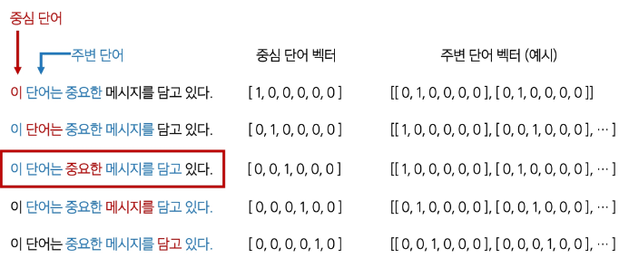
#### 
### Word2Vec 활용
- 필요한 라이브러리 설치
  - Gensim
    - 자연어 처리 라이브러리
    - Word2Vec, Doc2Vec 등 임베딩 관련 알고리즘 지원
  - Konlpy
    - 한국어 자연어 처리(NLP)에 특화된 라이브러리
    - 형태소 분석기, 불용어 제거 등의 기초 전처리 지원
#### ※ 주의사항
- colab의 기본 제공 numpy 버전은 2.0.2
- 2025.4 기준, 최신버전의 gensim은 numpy 1.26.4 버전을 사용중
  1. gensim 설치 과정에서 numpy 버전이 1.26.4로 조정되었음
  2. 그러나, 현재 실행중인 세션 환경에서는 여전히 numpy 버전이 2.0.2
  3. 런타임 > 세션 다시 시작을 통해 실행중인 numpy 버전을 1.26.4로 갱신 필요
  4. numpy version 확인
- 세션 다시 시작 전에 numpy 버전을 확인할 경우, 1.26.4 버전으로 출력되지만, 실제로는 2.0.2 버전을 사용중이므로, 반드시 세션 다시 시작을 실행해야 함
---
- 필요한 라이브러리 import
```python
from gensim.models.word2vec import Word2Vec
from konlpy.tag import Okt  # 형태소 분석기
# 문자열 정리를 위해 정규 표현식 라이브러리 사용
import re 
```
- 데이터 수집
  - '대한민국 헌법.txt' 파일 업로드
```python
with open("대한민국헌법.txt", encoding='cp949') as f:
	content = f.read()

print(len(content)) # 19063글자로 이루어진 문서
```
- 데이터 전처리 - 불필요한 문자 제거
```python
# 데이터 정리
print("[정리 전]\n", content[:100])

# 문장별로 분리하기 (한글 기준, '.', '?', '!' 뒤에 공백이 오거나 개행이 오는 경우 분리)
docs = re.split(r'(?<=[.?!])\s+', content.strip())

# 정규 표현식을 통한 한글 외 문자 제거
docs = [re.sub("[^ㄱ-ㅎㅏ-ㅣ가-힣 ]","", doc) for doc in docs]
print("-"*50)
print("[정리 후]\n", docs[:5]) # 정리 후 5개 문장 확인
```
- 데이터 전처리 - 문장을 단어로 분리(토큰화)
```python
# 불용어(분석에 도움이 되지 않는 단어들) 목록을 미리 정의
# 예: 조사(의, 가, 이, 는, 등), 자주 등장하지만 의미가 적은 단어(좀, 잘 등)
stopwords = ['의','가','이','은','들','는','좀','잘','걍','과','도','를','으로','자','에','와','한','하다']

# 형태소 분석기 OKT를 사용하여 문장들을 형태소(단어 단위)로 나눌 준비
okt = Okt()

# 최종 토큰(단어)들을 모아둘 리스트
tokenized_data = []
# 각 문장(docs의 원소)에 대해 반복하면서 토큰으로 만듦
for sentence in (docs):
    # okt.morphs: 문장을 형태소(단어) 단위로 나눔. 
    # stem=True: 어간 추출(원형 복원) 수행
    tokenized_sentence = okt.morphs(sentence, stem=True)
    # 불용어 목록에 있는 단어들을 제거
    sentence = [word for word in tokenized_sentence if not word in stopwords]
    # 정제된 단어 리스트를 tokenized_data에 추가
    tokenized_data.append(sentence)
print(tokenized_data)
```
- 한글 토큰을 100 차원의 워드 임베딩 벡터로 변환
```python
# sentences: 학습에 사용할 토큰화된 문장들
# vector_size: 단어 벡터 차원 크기(100차원)
# window: 주변 단어를 고려하는 윈도우 크기(5)
# min_count: 최소 등장 횟수(1회 미만이면 무시)
# workers: 병렬 작업 쓰레드 수(4)
# sg: 0이면 CBOW 방식, 1이면 Skip-Gram 방식
model = Word2Vec(
    sentences = tokenized_data,
    vector_size = 100,
    window = 5,
    min_count = 1,
    workers = 4,
    sg = 0
)
```
- 출력 결과 확인
```python
# 가장 많은 빈도수를 보이는 단어 50개 출력
print(model.wv.index_to_key[:50])
```
```text
['을', '제조', '법률', '되다', '있다', '정', '수', '대통령', '의하다', ...]
```
- 불용어 처리시 상황에 따라 적절한 처리가 필요한 이유
  - 언어별 특성을 잘 반영해야 함
  - 문서/도메인의 특성이 잘 반영되어야 함
    - 예를 들어, 법률 문서에서는 '제, 조, 항' 등이 불용어일 수 있지만, 다른 문서에서는 의미가 다를 수 있음
- 불용어 정의 업데이트 및 코드 재실행 후, 결과 확인
```python
# '을' 추가
stopwords = ['을', '의','가','이','은','들','는','좀','잘','걍','과','도','를','으로','자','에','와','한','하다']
tokenized_data = []
for sentence in (docs):
    tokenized_sentence = okt.morphs(sentence, stem=True)
    sentence = [word for word in tokenized_sentence if not word in stopwords]
    tokenized_data.append(sentence)

model = Word2Vec(
    sentences = tokenized_data,
    vector_size = 100,
    window = 5,
    min_count = 1,
    workers = 4,
    sg = 0
)

# 가장 많은 빈도수를 보이는 단어 50개 출력
print(model.wv.index_to_key[:50])
```
```text
['제조', '법률', '되다', '있다', '정', '수', '대통령', '의하다', ...]
```
- '법률' 단어의 100차원 벡터 임베딩 결과 확인
```python
# "법률"이라는 단어가 학습된 100차원 벡터를 확인
print(model.wv.get_vector("법률"))
print(len(model.wv.get_vector("법률")))
```
- -1부터 1 사이로 이루어진 좌표 값
```text
[-0.0123242   0.01595568  0.00411581  0.00331498  0.01174028 -0.0281026 ...]
```
- 총 길이 = 100
- 코사인 유사도 함수
  - '법률' 단어와 '헌법' 단어 벡터 간의 코사인 유사도 계산
```python
import numpy as np
from numpy import dot
from numpy.linalg import norm

# 코사인 유사도 함수
def cosine_similarity(A, B):
    return dot(A, B) / (norm(A) * norm(B))

# '법률'단어 벡터와 '헌법' 단어 벡터 간의 코사인 유사도 계산
similarity_value = cosine_similarity(model.wv.get_vector('법률'), model.wv.get_vector('헌법')                        )
print("'법률'과 '헌법'의 코사인 유사도:", similarity_value)  # 0.7452134
```
- 특정 단어와 가장 유사한 단어 출력
```python
# 학습된 벡터 중, '헌법'과 가장 유사도가 높은 순으로 10개 단어를 출력
most_similar_words = model.wv.most_similar('헌법')
print("헌법과 유사한 단어 Top 10:", most_similar_words)
```
- 헌법과 유사한 단어 Top 10
```text
헌법과 유사한 단어 Top 10: [('의하다', 0.7957236170768738), ('대통령', 0.7844078540802002), ('제조', 0.7807353734970093), ...]
```
## 문서 임베딩(Document Embedding)
- 여러 단어로 이루어진 문장, 문서를 임베딩하는 방법
- 문서별로 고유 문서 태그(문서 ID)를 부여
- Word2Vec과 유사하게 중심 단어와 주변 단어를 예측
  - 문서(문장)을 대표하는 문서 태그를 은닉층에 함께 학습
  - 이 문서 태그 임베딩이 결국 해당 문서를 대표하는 벡터가 됨
- 문서의 단어들을 입력으로 받고(또는 Skip-Gram이면 단어를 예측)
- Doc2Vec 모델을 사용하여 '문서 태그 + 단어 임베딩'을 동시에 업데이트
### Doc2Vec 활용
- 필요한 라이브러리 설치
  - Gensim 설치 후, 런타임 > 세션 다시 시작 실행
- Doc2Vec 및 Okt 불러오기
```python
from gensim.models import Doc2Vec
from konlpy.tag import Okt
```
- 한국어 문장을 임베딩 벡터로 변환
```python
from gensim.models.doc2vec import TaggedDocument

docs=[
    '자바스크립트는 웹사이트에 동적인 기능을 추가하는 핵심 프로그래밍 언어입니다',
    '일본 도쿄는 현대적인 도심과 전통 문화가 공존하는 인기 여행지입니다.',
    '파이썬은 데이터 분석과 인공지능 개발에 널리 사용되는 프로그래밍 언어입니다.',
    '김치찌개는 매운맛을 즐기는 한국인들에게 사랑받는 대표적인 국물 요리입니다.',
    '스페인 바르셀로나는 건축가 가우디의 예술 작품과 맛있는 해산물 요리로 유명합니다'
]

# 형태소 분석기
okt = Okt()

documents = []
for i,doc in enumerate(docs):
    # okt.morphs: 문장을 형태소(단어) 단위로 나눔. 
    documents.append(TaggedDocument(tags=[i],words=okt.morphs(doc)))
print('문서의 수 :', len(documents))
```
- 한글 문장을 300차원 벡터로 변환하기 위한 Doc2Vec 모델 생성
- alpha(학습률): 모델이 학습을 통해 가중치를 업데이트하는 정도
  - 학습률이 높을수록 가중치 업데이트가 크게 이루어짐
```python
# 여기서 학습률이란, 모델이 학습을 통해 가중치를 업데이트하는 정도를 의미
# 학습률이 높을수록 가중치 업데이트가 크게 이루어지며, 낮을수록 작게 이루어짐.
model = Doc2Vec(
    vector_size=300,    # 벡터의 차원
    min_count=1,        # 단어 최소 빈도수
    alpha=1.0,            # 학습률
    min_alpha=0.025,    # 학습률 초기값
    window=4            # 문맥의 크기
  )
```
- 모델이 학습할 문서 빌드 및 Doc2Vec 학습
```python
# Vocabulary 빌드
# 모델이 학습 할 문서 빌드
model.build_vocab(documents)

# Doc2Vec 학습
# model.corpus_count: 학습 할 문서의 총 개수
# epochs: 학습 할 에포크 수
model.train(documents, total_examples=model.corpus_count, epochs=20)
```
- 첫번째 문장과 문장별 유사도 출력
```python
# 첫번째 문장과 가장 유사한 문장은 1번 문장?
model.dv.most_similar(0)

'''
    출력 결과
    [(1, 0.9072750806808472),
    (2, 0.9051600098609924),
    (4, 0.10807963460683823),
    (3, 0.04453643783926964)]
'''
```
### 결과가 불만족스러운 이유
1. 문장 길이가 너무 짧고 단어 수가 적음
   - 학습 정보가 부족하여, 모델이 제대로 구분할 만한 특징을 잡기 어려움
2. 주제별 키워드가 불충분하거나 겹치는 어휘가 많음
   - 기계학습, 데이터 등 핵심 단어가 충분히 반복되어야 함
3. 학습 파라미터 및 데이터 규모 한계
   - 소수의 짧은 문장만으로 Doc2Vec을 학습하면, 토픽별 임베딩이 명확히 분리되지 않을 수 있음
## Word2Vec vs Doc2Vec
#### 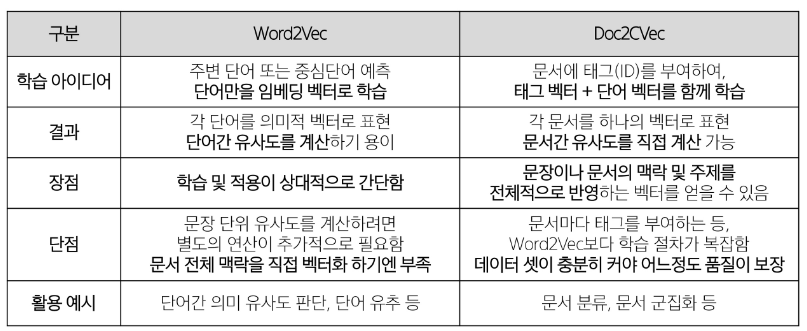
## 생성형 AI 기반 임베딩
- GPT 계열 같은 대규모 언어 모델(LLM)에서 제공하는 임베딩 기능 활용
  - LLM은 이미 엄청난 텍스트 코퍼스(말뭉치)로 사전 학습되어 있음
  - 복잡한 자연어 전처리 불필요(토큰화, 불용어 제거 등)
- 문장/문서를 입력하면, 모델 내부의 숨은 표현을 활용해 의미가 반영된 벡터를 얻을 수 있음
- API로 텍스트 전달 => 임베딩 벡터 반환
  - OpenAI, Upstage 등
### 생성형 AI 기반 임베딩 1 - OpenAI API 활용
- OpenAI client 및 문서 정보 정의
```python
from openai import OpenAI
from google.colab import userdata

# OpenAI API 활용
# client = OpenAI(api_key="OPEN_AI_API_KEY")
api_key = userdata.get('GMS_KEY')
# OpenAI API 키 설정
client = OpenAI(base_url="https://gms.ssafy.io/gmsapi/api.openai.com/v1", api_key=api_key)

passage_list = [
    "먹고 싶은 사과",
    "먹고 싶은 바나나",
    "길고 노란 바나나 바나나",
    "봄이 와서 날씨가 좋습니다",
]
```
- OpenAI Embedding 요청
- 수업에서는 Model은 'text-embedding-3-small' 사용(가장 저렴)
- passage_list에 있는 각 문장을 벡터로 변환
#### 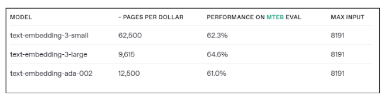
- OpenAI Embedding 요청 결과 확인
```python
# OpenAI Embedding 요청
# passage_list에 있는 각 문장을 벡터로 변환
response = client.embeddings.create(
    model="text-embedding-3-small",
    input=passage_list
).data

from pprint import pprint
pprint(response)
```
#### 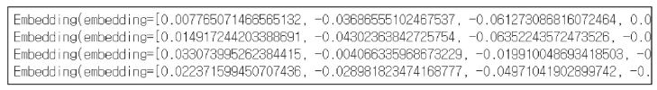
- 요청 결과 중, embedding 벡터만 추출
- 문장이 각각 1536 차원 벡터로 변환되었음을 확인
```python
######################################
# 결과에서 'embedding' 벡터만 추출
######################################
passage_embedding_list = [item.embedding for item in response]

# 임베딩 차원 확인
# 문장이 각각 1536 차원 벡터으로 변환 되었음을 확인
print(len(passage_embedding_list[0]),
      len(passage_embedding_list[1]),
      len(passage_embedding_list[2]),
      len(passage_embedding_list[3]))
```
- 문서간 코사인 유사도 분석
```python
from numpy import dot
from numpy.linalg import norm

def cosine_similarity(A, B):
    # 코사인 유사도 = (A 내적 B) / (A 길이 x B 길이)
    return dot(A, B) / (norm(A) * norm(B))

# 문서(문장)들 간의 코사인 유사도 출력
for i in range(len(passage_embedding_list)+1):
    for j in range(i+1, len(passage_embedding_list)):
        similarity = cosine_similarity(passage_embedding_list[i],
                                       passage_embedding_list[j])
        print(f'문서 {i+1}과 문서 {j+1}의 유사도 : {similarity}')
```
#### 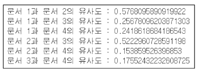
### 생성형 AI 기반 임베딩 2 - upstage 활용
- upstage: AI 통합 솔루션 제공 플랫폼
- Upstage embeddings 시작하기
  - Upstage AI API 공식 문서 접속 및 회원가입(google 계정)
  - Embeddings 문서로 이동
  - Example 1 확인
    - OpenAI 모듈 사용
    - 개인용 api_key가 예시에 작성되어 있음
#### 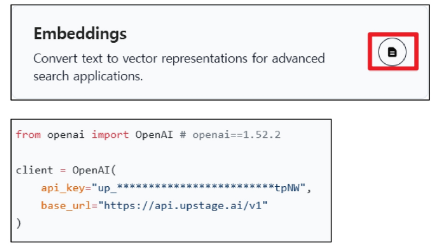
- 도서 제목 및 설명 정의
```python
doc5_titles = [
    "자바스크립트언어",
    "일본관광시기",
    "파이썬언어",
    "기계학습기초",
    "스페인방문계절"
]

doc5_desc = [
    "자바스크립트는 웹 개발에 필수적인 프로그래밍 언어입니다.",
    "일본은 벚꽃이 피는 봄이 관광하기 가장 좋은 시기입니다.",
    "파이썬 언어는 데이터분석과 기계학습에 효율적인 프로그래밍 언어입니다",
    "기계학습은 데이터를 활용하여 컴퓨터가 학습하도록 하는 기술입니다.",
    "스페인은 날씨가 온화한 봄이나 가을에 방문하는 것이 이상적입니다."
]
```
- OpenAI API를 활용하여 client 및 embedding 생성
```python
from openai import OpenAI
from google.colab import userdata

api_key = userdata.get('UPSTAGE_API_KEY')

client = OpenAI(
    api_key=api_key,
    base_url="https://api.upstage.ai/v1/solar"
)

response = client.embeddings.create(
    model = "embedding-passage",
    input = doc5_desc
).data

embedding_vectors = [i.embedding for i in response]
```
#### 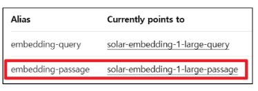
- 응답 데이터에서 임베딩 벡터 데이터 추출, 벡터 차원 확인
```python
# 임베딩 벡터 데이터만 리스트로 추출
embedding_vectors = [i.embedding for i in response]
# 생성된 벡터 데이터수 == 문서 수
print(len(embedding_vectors))
# 업스테이지 임베딩 모델의 벡터 차원 == 4096
print(len(embedding_vectors[0]))
```
- 문서 간 코사인 유사도 계산(sklearn 제공 cosine_similarity 활용)
```python
from sklearn.metrics.pairwise import cosine_similarity

similarities = cosine_similarity(embedding_vectors, embedding_vectors)
print(similarities)
```
#### 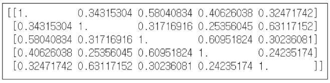
- 첫번째 도서의 유사도 정보 정렬
```python
# 첫번째 책의 각 책과의 유사도 정보 (index, 유사도)
sim_scores = list(enumerate(similarities[0]))

# 유사 기준 내림차순 정렬
sim_scores.sort(key = lambda x: x[1], reverse = True)

# 자기 자신은 제외한 상위 3개 문서 출력
print(sim_scores[1:4] )
```
### 임베딩 기반 문서 유사도 응용
- 도서 정보를 토대로 도서간 유사도 값을 계산
- 도서의 고유 ISBN 값(예시에서는 index)을 활용하여 도서 추천기능 구현
  1. 도서 제목을 입력 받음
  2. 입력받은 제목의 도서가 기존 DB에 존재하는지 확인
  3. 있다면, 해당 도서의 코사인 유사도 계산 결과값 활용
  4. 가장 유사도가 높은 값을 가진 책의 고유값 반환
  5. 반환받은 값으로 DB에서 도서 제목 검색
  6. 사용자에게 도서 제목 반환
```python
books_titles = doc5_titles

def recommendations(title):
    # 책의 제목을 입력하면 해당 제목의 인덱스를 리턴받아 idx에 저장.
    if title in books_titles :
        idx=books_titles.index(title)
        similar_doc = similarities[idx]
    else :
        print("도서 정보가 존재하지 않습니다.")
        return []

    # 입력된 책과 줄거리(document embedding)가 유사한 책 3개 선정.
    sim_scores = list(enumerate(similar_doc)) # (index, 유사도) 튜플의 리스트
    sim_scores = sorted(sim_scores, key = lambda x: x[1], reverse = True) # 유사도 높은 순서로 sorting
    sim_scores = sim_scores[1:4] # 자기 자신은 제외한 상위 3개
    print(sim_scores)

    similar_books_titles = []
    # 유사한 책 제목 출력
    for index, book_info in sim_scores:
        title=books_titles[index]
        similar_books_titles.append(title)

    return similar_books_titles
```
# 참고
## pickle
- 파이썬 객체 구조의 직렬화와 역직렬화를 위한 바이너리 프로토콜을 구현
### 벡터 데이터 직렬화
```python
import pickle

# 임베딩 벡터 pickle로 저장하기
with open("embedding_vectors_upstage_doc5.pickle","wb") as f:
    pickle.dump(embedding_vectors, f)

# pickle로 불러오기
with open("embedding_vectors_upstage_doc5.pickle","rb") as f:
    embedding_vectors=pickle.load(f)
    print(embedding_vectors)

# 코싸인 유사도 pickle로 저장하기
with open("similarities_upstage_doc5.pickle","wb") as f:
    pickle.dump(similarities, f)

# pickle로 불러오기
with open("similarities_upstage_doc5.pickle","rb") as f:
    similarities=pickle.load(f)
    print(similarities)
```